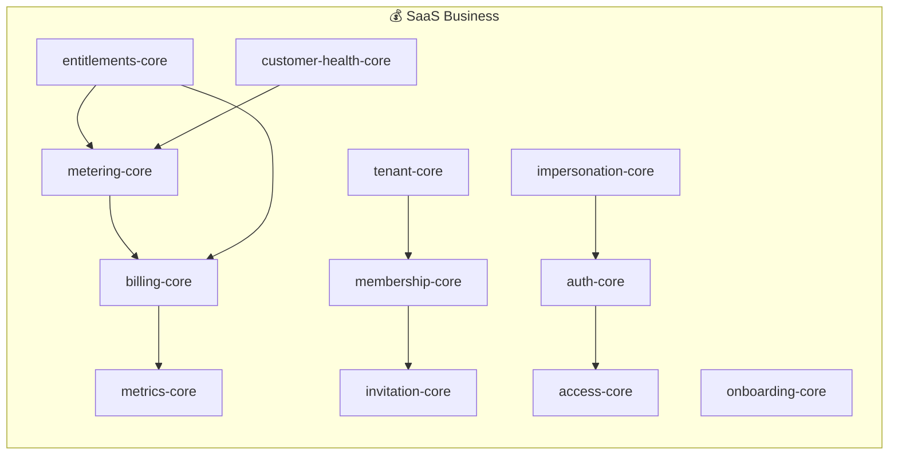

# SaaS 3대 패키지 구현 + README 대폭 확장

## Context
- **프로젝트**: Croco Framework (TypeScript 모노레포, 73개 → 78개 패키지)
- **브랜치**: trunk 직접 커밋
- **Phase 1**: SaaS 패키지 5개 신규 구현 (entitlements-core, entitlements-drizzle, customer-health-core, customer-health-drizzle, impersonation-core)
- **Phase 2**: README를 78개 전체 패키지 카탈로그로 확장 + SaaS-first 포지셔닝 + 로드맵 10개
- **구현 순서**: ① entitlements → ② customer-health → ③ impersonation → ④ README 확장
- **기존 패키지 수정**: audit-core 최소 수정 허용 (D4 Oracle UNSAFE 대응), 나머지 패키지 변경 금지
- **언어**: 한국어 유지

## Key Decisions — SaaS 패키지 (D1-D13 + Oracle 리뷰 반영)

### D1: billing-core Plan 타입 수정 금지
Plan `{id, name, amount, currency, interval}` 변경하지 않는다. entitlements-core의 `PlanEntitlementRegistry`가 planId 문자열만으로 독립 매핑을 관리한다.

### D2: Subscription 조회 경로
entitlements-core는 `SubscriptionProvider` 인터페이스를 정의. billing-core의 `BillingStore`를 래핑하는 어댑터를 entitlements-drizzle에 배치. billing 없는 환경용 `StaticSubscriptionProvider` (InMemory) 제공.

### D3: ImpersonationContext 전파 — Option C
`ImpersonationContext = RequestContext & { impersonation: {...} }`를 impersonation-core에서 정의. framework-context의 RequestContext 타입은 수정하지 않는다. `Context.run()`에 확장 타입 전달.

### D4: @Auditable 최소 수정 — Oracle UNSAFE → FIX
audit-core `@Auditable`에서 impersonation 중 `actorId`를 impersonator로 기록하도록 수정. 런타임 프로퍼티 체크(`'impersonation' in context`)로 impersonation-core 타입 의존성 없음. ImpersonationAuditHelper는 추가 메타데이터 기록용으로 유지.

### D5: customerId → tenantId 통일
프레임워크 전체 컨벤션에 맞춰 customer-health-core에서도 `tenantId`를 사용한다. `customerId` 용어 사용 금지.

### D6: SignalProvider 어댑터 위치
customer-health-core: 인터페이스(SignalProvider)와 순수 계산 로직(HealthScoreCalculator)만.
customer-health-drizzle: metering-core + billing-core 어댑터 + DB 저장소. metrics-core 어댑터는 이번 스코프에서 제외.

### D7: Quota 우선순위
EntitlementRule.quota가 MeterDefinition.quota보다 항상 우선한다. EntitlementManager가 QuotaManager에 quota 값을 주입할 때 Plan 기반 값을 사용.

### D8: DomainEvent 규칙
모든 이벤트 클래스에 `static eventName` 필수. 누락 시 런타임 `EventDefinitionProblem` throw. 네이밍 패턴: `{domain}.{entity}.{action}` (예: `entitlements.check.denied`).

### D9: Guard 체인 순서
AuthGuard → PermissionGuard → EntitlementGuard. `@UseGuards(AuthGuard, PermissionGuard, EntitlementGuard)` 배열 선언 순서 = 실행 순서. RouteCompiler가 `[...globalGuards, ...routeGuards]` 순서대로 실행하므로 별도 `order` 필드 불필요.

### D10: ImpersonationStore — InMemory만
Redis/Drizzle 기반 세션 저장은 이번 스코프에서 제외. `ImpersonationStore` 인터페이스 + `InMemoryImpersonationStore` (Map + TTL)만 구현.

### D11: HealthScoreCalculator — 배치 전용
API 요청 경로에서 실시간 계산하지 않는다. `HealthScoreScheduler`가 주기적으로 계산 → DB에 저장. `CustomerHealthService`는 캐시/DB에서 마지막 결과를 반환.

### Oracle 검증 결과
| 결정 | 판정 | 조건 |
|------|------|------|
| D1 | CONDITIONAL | planId ↔ mapping 완전성 검증 필수, 미매핑 plan = 기본 deny |
| D2, D3, D5, D12, D13 | SAFE | — |
| D4 | FIX (was UNSAFE) | audit-core 최소 수정 허용 (위 D4 참조) |
| D7 | CONDITIONAL | 동일 meter/단위에서만 override, 누락 시 MeterDefinition.quota fallback |
| D9 | CONDITIONAL | guard 순서 검증 통합 테스트 필수 |
| D10 | CONDITIONAL | 단일 인스턴스/프로세스 전제, 세션 유실 수용 |
| D11 | CONDITIONAL | score에 생성 시각(calculatedAt) 포함, 실시간 진실값으로 사용 금지 |

## Key Decisions — README 확장 (RD1-RD8)

### RD1: 성숙도 뱃지 기준
| 뱃지 | 기준 |
|------|------|
| 🟢 Stable | 1000+ 코드 줄 AND 테스트 3개 이상 존재 |
| 🟡 Beta | 300~999줄 OR 구현 완료이나 테스트 부족 |
| 🔴 Alpha | <300줄 OR stub 수준 OR API 불안정 |
| ⚫ Deprecated | 명시적으로 deprecated 표시된 것 |

참고: 신규 5개 패키지는 구현 직후이므로 🟡 Beta (entitlements-core, customer-health-core, impersonation-core) 또는 🔴 Alpha (drizzle 구현체). 실제 줄 수/테스트 수로 재분류.

### RD2: npm 링크 컬럼 — 제외
현재 73개 중 2개만 배포됨. 71개가 빈 링크인 테이블은 신뢰도를 떨어뜨림. npm 배포 후 별도 PR로 추가.

### RD3: create-croco-app — "Coming Soon" 처리
npm 미배포 상태이므로 Quick Start에 `npx` 명령 포함 금지. 별도 "🚀 시작하기" 섹션에서 "준비 중"으로 안내.

### RD4: docs 패키지 — 카탈로그 제외
`@croco/docs`는 npm 라이브러리가 아닌 문서 사이트. 카탈로그에서 제외하고 별도 "📚 문서" 섹션에서 링크.

### RD5: `-drizzle` 접미사 패키지 — 상위 도메인 하위 행
`invitation-drizzle`, `access-drizzle` 등은 독립 행이 아닌, 상위 core 패키지의 "구현체" 표시로 통합.

### RD6: SaaS 추가 기능 10개 — README 말미 "🗺️ 로드맵" 섹션
별도 파일이 아닌 README 내 섹션. 각 항목 3줄 이내. 설계 문서로 확장 금지.

### RD7: 유령 패키지 처리
현재 README의 `transports-websocket`, `integrations-slack`, `protocols-grpc`는 실제 존재하지 않음. 카탈로그에서 완전 제거.

### RD8: Mermaid 아키텍처 다이어그램
기존 4계층 다이어그램은 유지하되, 유령 패키지 참조 수정. SaaS 모듈은 별도 다이어그램으로 추가 (신규 3패키지 포함).

## Quality Checklist

### SaaS 패키지 공통
- 각 패키지에 `InMemory*` 구현체 포함 (테스트용)
- 테스트 파일 위치: `src/tests/[ClassName].spec.ts`
- 이벤트 클래스에 `static eventName` 필수 포함
- barrel export in `src/index.ts` — 카테고리별 그룹, types 마지막
- import type { X } 사용 (type imports 분리)
- Biome 규칙 준수 (single quotes, trailing commas ES5, 120 char width)

### README 확장 공통
- `packages/*/package.json` 기준으로만 패키지 나열 (유령 패키지 금지)
- README에 언급된 모든 패키지명이 실제 디렉토리에 존재하는지 검증
- 성숙도 뱃지 합계 = 카탈로그 패키지 수 (77개: 기존 72 + 신규 5, docs 제외)
- Mermaid 다이어그램이 GitHub에서 렌더링되는지 확인
- 한국어 맞춤법/어조 일관성

---

## Phase 1: SaaS 패키지 구현

### Package 1: entitlements-core

### TASK 1: 패키지 스캐폴딩
- [x] `packages/entitlements-core/` 디렉토리 생성
- [x] `package.json` 생성: name `@croco/entitlements-core`, version `0.1.0`, dependencies: `@croco/framework-context: workspace:*`, `@croco/auth-core: workspace:*`, `@croco/metering-core: workspace:*`, `@croco/problems-core: workspace:*`, `@croco/events-core: workspace:*`
- [x] `tsconfig.json` 생성 — 기존 패키지 (예: `metering-core/tsconfig.json`) 복사
- [x] `src/index.ts` 빈 파일 생성
- [x] `src/libs/` 디렉토리 생성
- [x] `src/tests/` 디렉토리 생성
- [x] QA: `pnpm install` 성공, `pnpm build --filter=@croco/entitlements-core` 빈 빌드 성공

### TASK 2: 타입 정의
- [x] `src/libs/types.ts` 생성:

```typescript
export type EntitlementType = 'boolean' | 'metered' | 'static';
export type OveragePolicy = 'block' | 'warn' | 'allow';

export type EntitlementRule = {
  featureKey: string;
  type: EntitlementType;
  value?: number;           // static: 고정 숫자 값 (예: "최대 5 팀원")
  meterId?: string;         // metered: metering-core 연결
  quota?: number;           // metered: 사용량 한도
  overagePolicy?: OveragePolicy; // 기본: 'block'
};

export type PlanEntitlements = {
  planId: string;
  entitlements: EntitlementRule[];
};

export type EntitlementCheckResult = {
  granted: boolean;
  featureKey: string;
  type: EntitlementType;
  // metered 전용
  usage?: number;
  quota?: number;
  remaining?: number;
  exceeded?: boolean;
  // static 전용
  value?: number;
  // 판단 근거
  planId?: string;
  reason?: string;
};
```

- [x] `src/libs/interfaces.ts` 생성:

```typescript
export abstract class SubscriptionProvider {
  static readonly token = new Token<SubscriptionProvider>('SubscriptionProvider');
  abstract getCurrentPlanId(tenantId: string): Promise<string | null>;
}
```

- [x] QA: `pnpm typecheck --filter=@croco/entitlements-core` 성공

### TASK 3: PlanEntitlementRegistry 구현
- [x] `src/libs/PlanEntitlementRegistry.ts`: 추상 클래스 (interfaces.ts에 정의됨)

```typescript
export abstract class PlanEntitlementRegistry {
  abstract getEntitlements(planId: string): Promise<EntitlementRule[]>;
  abstract findRule(planId: string, featureKey: string): Promise<EntitlementRule | null>;
}
```

- [x] `src/libs/InMemoryPlanEntitlementRegistry.ts`: Map 기반 구현

```typescript
@Component()
export class InMemoryPlanEntitlementRegistry extends PlanEntitlementRegistry {
  private readonly registry = new Map<string, EntitlementRule[]>();
  register(planId: string, rules: EntitlementRule[]): void { ... }
  // ...
}
```

- [x] `src/libs/StaticSubscriptionProvider.ts`: 테스트/billing 없는 환경용

```typescript
@Component()
export class StaticSubscriptionProvider implements SubscriptionProvider {
  constructor(private readonly defaultPlanId: string) {}
  async getCurrentPlanId(_tenantId: string): Promise<string> {
    return this.defaultPlanId;
  }
}
```

- [x] `src/tests/PlanEntitlementRegistry.spec.ts`: register/getEntitlements/findRule 테스트
- [x] QA: 테스트 통과

### TASK 4: EntitlementManager 구현
- [x] `src/libs/EntitlementManager.ts`: 핵심 평가 엔진 (DI: EntitlementQuotaChecker, EntitlementMeterLookup 추상 클래스 사용)

```typescript
@Component()
export class EntitlementManager {
  constructor(
    @Inject() private readonly registry: PlanEntitlementRegistry,
    @Inject() private readonly subscriptionProvider: SubscriptionProvider,
    @Inject() private readonly quotaManager: QuotaManager, // metering-core
    @Inject() private readonly meterRegistry: MeterRegistry, // metering-core, D7 quota fallback
  ) {}

  async check(tenantId: string, featureKey: string): Promise<EntitlementCheckResult> {
    const planId = await this.subscriptionProvider.getCurrentPlanId(tenantId);
    if (!planId) return { granted: false, featureKey, type: 'boolean', reason: 'no_subscription' };
    const rule = await this.registry.findRule(planId, featureKey);
    if (!rule) return { granted: false, featureKey, type: 'boolean', reason: 'not_entitled' };
    switch (rule.type) {
      case 'boolean': return { granted: true, featureKey, type: 'boolean', planId };
      case 'static': return { granted: true, featureKey, type: 'static', value: rule.value, planId };
      case 'metered': return this.checkMetered(tenantId, featureKey, rule, planId);
    }
  }

  private async checkMetered(tenantId, featureKey, rule, planId): Promise<EntitlementCheckResult> {
    const meterDef = await this.meterRegistry.get(tenantId, rule.meterId!);
    const quota = rule.quota ?? meterDef?.quota; // D7: EntitlementRule.quota 우선, 누락 시 MeterDefinition.quota fallback
    if (quota == null) return { granted: false, featureKey, type: 'metered', reason: 'no_quota_defined' };
    // QuotaManager.checkAndRecord에 quota를 동적 주입
    // rule.overagePolicy에 따라 block/warn/allow 분기
  }
}
```

- [x] `src/tests/EntitlementManager.spec.ts`: boolean/static/metered 각각 테스트, no_subscription 케이스, not_entitled 케이스 (7개 테스트, 수동 인스턴스화)
- [x] QA: 5개 이상 테스트 케이스 통과 (총 12개 테스트 통과)

### TASK 5: @RequireEntitlement 데코레이터 + Guard
- [x] `src/libs/decorators/RequireEntitlement.ts`: 메서드 데코레이터

```typescript
export function RequireEntitlement(options: { feature: string; onDenied?: () => void }): MethodDecorator {
  // MetadataStorage에 entitlement 메타데이터 저장
}
```

- [x] `src/libs/EntitlementGuard.ts`: Guard 구현 (auth-core `Guard<RouteExecutionContext>` 패턴 따르기, Guard/RouteExecutionContext는 로컬 재정의)

```typescript
import type { Guard, RouteExecutionContext } from '@croco/auth-core';

const ENTITLEMENT_KEY = Symbol('entitlement');

@Component()
export class EntitlementGuard implements Guard<RouteExecutionContext> {
  constructor(
    @Inject() private readonly entitlementManager: EntitlementManager,
  ) {}

  async canActivate(context: RouteExecutionContext): Promise<boolean> {
    const request = context.getRequest();
    const target = context.getClass();
    const handler = context.getHandler();
    const featureKey = Reflect.getMetadata(ENTITLEMENT_KEY, target, handler) as string | undefined;
    if (!featureKey) return true; // 메타데이터 없으면 통과
    const tenantId = request.tenantId ?? request.user?.tenantId;
    if (!tenantId) throw new EntitlementDeniedProblem(featureKey, 'no_tenant');
    const result = await this.entitlementManager.check(tenantId, featureKey);
    if (!result.granted) throw new EntitlementDeniedProblem(featureKey, result.reason);
    return true;
  }
}
```

- [x] QA: Guard가 RouteExecutionContext에서 메타데이터를 읽어 entitlement 체크하는지 테스트 (6개 테스트 통과)

### TASK 6: 이벤트 + 에러 클래스
- [x] `src/libs/events.ts`:

```typescript
export class EntitlementDeniedEvent extends DomainEvent {
  static eventName = 'entitlement.denied';
  constructor(public readonly tenantId: string, public readonly featureKey: string, public readonly reason: string) { super(); }
}
export class EntitlementQuotaExceededEvent extends DomainEvent {
  static eventName = 'entitlement.quota.exceeded';
  constructor(public readonly tenantId: string, public readonly featureKey: string, public readonly usage: number, public readonly quota: number) { super(); }
}
```

- [x] `src/libs/problems/EntitlementProblems.ts`: `EntitlementDeniedProblem`, `EntitlementNotFoundProblem` (problems-core 패턴)
- [x] `src/index.ts`: barrel exports (classes → decorators → events → problems → types)
- [x] QA: 이벤트 생성 시 `eventName` 존재 확인 (EventDefinitionProblem 안 나는지)

### TASK 7: entitlements-core 테스트 완성
- [x] 통합 시나리오 테스트: InMemoryPlanEntitlementRegistry + StaticSubscriptionProvider + EntitlementManager 조합
- [x] 시나리오: Free 플랜(projects:10개) → Pro 플랜(projects:무제한) 전환 시 entitlement 변경 확인
- [x] 시나리오: metered entitlement에서 quota 초과 시 OveragePolicy별 동작 확인
- [x] QA: `cd packages/entitlements-core && pnpm vitest run` 전체 통과 (27 tests)

---

### Package 2: entitlements-drizzle

### TASK 8: 패키지 스캐폴딩 + 스키마
- [x] `packages/entitlements-drizzle/` 디렉토리 생성
- [x] `package.json`: dependencies `@croco/entitlements-core`, `@croco/tx-drizzle`, `@croco/billing-core`, `@croco/framework-context`, `drizzle-orm`
- [x] `src/libs/schema.ts`: Drizzle 테이블 정의

```typescript
export const planEntitlements = pgTable('plan_entitlements', {
  id: text('id').primaryKey(),
  planId: text('plan_id').notNull(),
  featureKey: text('feature_key').notNull(),
  type: text('type').notNull(), // 'boolean' | 'metered' | 'static'
  value: integer('value'),
  meterId: text('meter_id'),
  quota: integer('quota'),
  overagePolicy: text('overage_policy').default('block'),
  createdAt: timestamp('created_at').defaultNow(),
});
```

- [ ] QA: 스키마 타입 검증

### TASK 9: DrizzlePlanEntitlementRegistry + BillingStoreSubscriptionProvider
- [x] `src/libs/DrizzlePlanEntitlementRegistry.ts`: `extends PlanEntitlementRegistry` + `@Component()` + `@Inject(DRIZZLE_TOKEN)` (audit-drizzle 패턴 따르기)
- [x] `src/libs/BillingStoreSubscriptionProvider.ts`: `implements SubscriptionProvider` — billing-core의 `BillingStore`를 래핑. **2단계 조회**: `findAccountByTenantId(tenantId)` → `findSubscription(billingAccountId)` → `subscription.planId` 반환. BillingAccount가 없거나 Subscription이 없으면 `null` 반환.
- [x] `src/index.ts`: barrel exports
- [x] `src/tests/DrizzlePlanEntitlementRegistry.spec.ts`
- [x] QA: 테스트 통과 (5 tests) + `pnpm typecheck`

---

### Package 3: customer-health-core

### TASK 10: 패키지 스캐폴딩
- [x] `packages/customer-health-core/` 디렉토리 생성
- [x] `package.json`: dependencies `@croco/framework-context`, `@croco/problems-core`, `@croco/events-core`
- [x] 주의: metering-core, billing-core, analytics-core에 직접 의존 금지! SignalProvider 인터페이스로 분리
- [x] `tsconfig.json`, `src/index.ts`, `src/libs/`, `src/tests/` 생성
- [x] QA: 빈 빌드 성공

### TASK 11: 타입 + 인터페이스 정의
- [x] `src/libs/types.ts`:

```typescript
export type SignalCategory = 'usage' | 'business' | 'engagement';
export type HealthStatus = 'healthy' | 'at_risk' | 'critical';
export type HealthTrend = 'improving' | 'stable' | 'declining';

export type HealthSignal = {
  category: SignalCategory;
  name: string;
  value: number;         // 0~100 정규화
  weight: number;        // 0~1
  rawValue: unknown;
  collectedAt: Date;
};

export type HealthScoreProfile = {
  id: string;
  name: string;
  weights: Record<SignalCategory, number>; // 합계 = 1.0
  thresholds: { healthy: number; atRisk: number }; // 예: { healthy: 80, atRisk: 40 }
};

export type TenantHealthScore = {
  tenantId: string;
  overallScore: number;     // 0~100
  status: HealthStatus;
  categoryScores: Record<SignalCategory, number>;
  signals: HealthSignal[];
  trend: HealthTrend;
  previousScore?: number;
  calculatedAt: Date;
};
```

- [x] `src/libs/interfaces.ts`:

```typescript
export abstract class SignalProvider {
  abstract readonly category: SignalCategory;
  abstract collect(tenantId: string): Promise<HealthSignal[]>;
}

export abstract class HealthScoreStore {
  abstract save(score: TenantHealthScore): Promise<void>;
  abstract findLatest(tenantId: string): Promise<TenantHealthScore | null>;
  abstract findHistory(tenantId: string, limit: number): Promise<TenantHealthScore[]>;
}

export abstract class HealthSignalRegistry {
  abstract getProviders(): SignalProvider[];
}
```

- [x] QA: 타입체크 통과

### TASK 12: HealthScoreCalculator — 순수 계산
- [x] `src/libs/HealthScoreCalculator.ts`: IO 없는 순수 계산 클래스

```typescript
export class HealthScoreCalculator {
  calculate(signals: HealthSignal[], profile: HealthScoreProfile): Omit<TenantHealthScore, 'tenantId' | 'calculatedAt' | 'trend'> {
    // 카테고리별 가중 평균
    // 임계값 기반 status 판단
    // 빈 signals → score: 0, status: 'critical'
  }

  determineTrend(current: number, previous: number | undefined): HealthTrend {
    // ±5 이내: stable, +5 이상: improving, -5 이상: declining
  }
}
```

- [x] `src/tests/HealthScoreCalculator.spec.ts`:
  - 가중 평균 정확성 (signal(80, 0.3) + signal(60, 0.7) → 66)
  - 빈 signals → score 0
  - 임계값 경계 테스트 (79→at_risk, 80→healthy)
  - trend 판단 테스트
- [x] QA: 16개 테스트 통과

### TASK 13: CustomerHealthService + 이벤트
- [x] `src/libs/CustomerHealthService.ts`: 오케스트레이터

```typescript
@Component()
export class CustomerHealthService {
  constructor(
    @Inject() private readonly signalRegistry: HealthSignalRegistry, // abstract class (core에서 정의)
    @Inject() private readonly store: HealthScoreStore,
    @Inject() private readonly calculator: HealthScoreCalculator,
  ) {}
  private readonly eventPublisher = new EventPublisher(EventBusConfig.getInstance()); // 수동 생성 (EventPublisher는 @Component 아님)

  async calculateAndStore(tenantId: string, profile: HealthScoreProfile): Promise<TenantHealthScore> {
    const signals = await this.collectSignals(tenantId); // signalRegistry.getProviders()에서 수집
    const previous = await this.store.findLatest(tenantId);
    const calculated = this.calculator.calculate(signals, profile);
    const trend = this.calculator.determineTrend(calculated.overallScore, previous?.overallScore);
    const score: TenantHealthScore = { tenantId, ...calculated, trend, previousScore: previous?.overallScore, calculatedAt: new Date() };
    await this.store.save(score);
    await this.publishEvents(score, previous);
    return score;
  }

  async getLatest(tenantId: string): Promise<TenantHealthScore | null> {
    return this.store.findLatest(tenantId); // 캐시/DB에서 반환, 실시간 계산 금지
  }
}
```

- [x] `src/libs/events.ts`:

```typescript
export class HealthStatusChangedEvent extends DomainEvent {
  static eventName = 'customer-health.status.changed';
  constructor(public readonly tenantId: string, public readonly from: HealthStatus, public readonly to: HealthStatus, public readonly score: number) { super(); }
}
export class HealthScoreDroppedEvent extends DomainEvent {
  static eventName = 'customer-health.score.dropped';
  constructor(public readonly tenantId: string, public readonly delta: number, public readonly currentScore: number) { super(); }
}
```

- [x] `src/libs/problems.ts`: `HealthScoreNotFoundProblem`
- [x] `src/libs/InMemoryHealthScoreStore.ts`: Map 기반
- [x] `src/index.ts`: barrel exports
- [x] QA: 서비스 + 이벤트 발행 통합 테스트

### TASK 14: customer-health-core 테스트
- [x] `src/tests/CustomerHealthService.spec.ts`: InMemoryHealthScoreStore + mock SignalProviders 조합
- [x] 시나리오: healthy → at_risk 전환 시 HealthStatusChangedEvent 발행 확인
- [x] 시나리오: 점수 -20 급락 시 HealthScoreDroppedEvent 발행 확인
- [x] 시나리오: getLatest()가 DB에서 반환 (실시간 계산 안 함) 확인
- [x] QA: 전체 테스트 통과 (22 tests passed)

---

### Package 4: customer-health-drizzle

### TASK 15: 스키마 + 저장소
- [ ] `packages/customer-health-drizzle/` 생성
- [ ] `package.json`: deps `@croco/customer-health-core`, `@croco/tx-drizzle`, `@croco/metering-core`, `@croco/billing-core`, `@croco/framework-context`, `drizzle-orm`
- [ ] `src/libs/schema.ts`: `tenant_health_scores` 테이블 (tenantId, overallScore, status, categoryScores:jsonb, signals:jsonb, trend, previousScore, calculatedAt)
- [ ] `src/libs/DrizzleHealthScoreStore.ts`: `extends HealthScoreStore` + `@Component()` + `@Inject(DRIZZLE_TOKEN)`
- [ ] QA: 스키마 + 구현 타입체크

### TASK 16: SignalProvider 어댑터
- [ ] `src/libs/MeteringSignalProvider.ts`: metering-core의 UsageStorage에서 사용량 데이터 → HealthSignal[] 변환

```typescript
@Component()
export class MeteringSignalProvider implements SignalProvider {
  readonly category: SignalCategory = 'usage';
  constructor(@Inject() private readonly usageStorage: UsageStorage) {}
  async collect(tenantId: string): Promise<HealthSignal[]> {
    // 핵심 meter들의 사용량 조회 → 0~100 정규화
  }
}
```

- [ ] `src/libs/BillingSignalProvider.ts`: billing-core의 BillingStore에서 구독 상태/결제 이력 → HealthSignal[] 변환

```typescript
@Component()
export class BillingSignalProvider implements SignalProvider {
  readonly category: SignalCategory = 'business';
  // Subscription.status → 점수 매핑: active=100, trialing=80, past_due=30, canceled=0
}
```

- [ ] `src/libs/DrizzleHealthSignalRegistry.ts`: `extends HealthSignalRegistry` + `@Component()`. 생성자에서 `MeteringSignalProvider`, `BillingSignalProvider`를 개별 `@Inject()`로 받아 `getProviders()` 배열로 반환. Container.getMany() 대신 명시적 생성자 주입 패턴 사용.
- [ ] `src/index.ts`: barrel exports
- [ ] `src/tests/MeteringSignalProvider.spec.ts`, `BillingSignalProvider.spec.ts`
- [ ] QA: 어댑터 테스트 통과

---

### Package 5: impersonation-core

### TASK 17: 패키지 스캐폴딩
- [x] `packages/impersonation-core/` 디렉토리 생성
- [x] `package.json`: deps `@croco/framework-context`, `@croco/auth-core`, `@croco/audit-core`, `@croco/problems-core`, `@croco/events-core`, `@croco/gid-core`
- [x] `tsconfig.json`, `src/index.ts`, `src/libs/`, `src/tests/` 생성
- [x] QA: 빈 빌드 성공

### TASK 18: 타입 + 인터페이스 정의
- [x] `src/libs/types.ts`:

```typescript
export type ImpersonationState = {
  sessionId: string;
  impersonatorId: string;
  targetUserId: string;
  reason?: string;
  startedAt: Date;
  expiresAt: Date;
};

// RequestContext 확장 (framework-context 수정 없이)
export type ImpersonationContext = RequestContext & {
  impersonation: ImpersonationState;
};

export type ImpersonationConfig = {
  maxDurationMs: number;     // 기본: 30분 (1800000)
  requireReason: boolean;    // 기본: false
  blockedActions: string[];  // 차단할 액션 목록
};

export const IMPERSONATION_CONFIG_TOKEN = new Token<ImpersonationConfig>('ImpersonationConfig');
```

- [x] `src/libs/interfaces.ts`:

```typescript
export abstract class ImpersonationStore {
  abstract save(session: ImpersonationState): Promise<void>;
  abstract find(sessionId: string): Promise<ImpersonationState | null>;
  abstract findByImpersonator(impersonatorId: string): Promise<ImpersonationState | null>;
  abstract revoke(sessionId: string): Promise<void>;
}
```

- [x] QA: 타입체크 통과

### TASK 19: ImpersonationService 핵심 구현
- [x] `src/libs/ImpersonationService.ts`: @Component, DI: ImpersonationStore, AuthProvider, IMPERSONATION_CONFIG_TOKEN, start/end/isImpersonating/getImpersonator 메서드, 3가지 검증 (자기 자신, 중첩, reason 필수)
- [x] QA: 타입 안전성 + 3가지 검증 로직 확인

### TASK 20: ImpersonationGuard + @BlockDuringImpersonation
- [x] `src/libs/ImpersonationGuard.ts`: `Guard<RouteExecutionContext>` 구현. 권한 형식: `'impersonation:manage'` (auth-core Permission 규칙: `{resource}:{action}`, action은 `read|write|delete|manage`만 허용)

```typescript
import type { Guard, RouteExecutionContext } from '@croco/auth-core';
import { hasPermission } from '@croco/auth-core';

@Component()
export class ImpersonationGuard implements Guard<RouteExecutionContext> {
  canActivate(context: RouteExecutionContext): boolean {
    const request = context.getRequest();
    const principal = request.principal ?? request.user;
    if (!principal) throw new UnauthorizedProblem();
    if (!hasPermission(principal.permissions, 'impersonation:manage')) {
      throw new ForbiddenProblem('impersonation:manage');
    }
    return true;
  }
}
```

- [x] `src/libs/decorators/BlockDuringImpersonation.ts`:

```typescript
export function BlockDuringImpersonation(): MethodDecorator {
  return (_target, propertyKey, descriptor) => {
    const original = descriptor.value;
    descriptor.value = async function (...args: unknown[]) {
      const context = Context.get();
      if (context && 'impersonation' in context && context.impersonation) {
        throw new BlockedDuringImpersonationProblem(String(propertyKey));
      }
      return original.apply(this, args);
    };
    return descriptor;
  };
}
```

- [x] QA: 데코레이터가 impersonation 컨텍스트 감지 테스트

### TASK 21: 이벤트 + 에러 + InMemory
- [x] `src/libs/events.ts`:

```typescript
export class ImpersonationStartedEvent extends DomainEvent {
  static eventName = 'impersonation.session.started';
  constructor(public readonly session: ImpersonationState) { super(); }
}
export class ImpersonationEndedEvent extends DomainEvent {
  static eventName = 'impersonation.session.ended';
  constructor(public readonly session: ImpersonationState) { super(); }
}
```

- [x] `src/libs/problems/ImpersonationProblems.ts`: SelfImpersonationProblem, NestedImpersonationProblem, ImpersonationReasonRequiredProblem (나머지 3개는 TASK 20에서 구현)
- [x] `src/libs/InMemoryImpersonationStore.ts`: Map + TTL (expiresAt 체크로 만료 처리)
- [x] `src/libs/ImpersonationAuditHelper.ts`: AuditLogEntry metadata에 impersonatorId 삽입 유틸

```typescript
export function withImpersonationAudit(metadata: Record<string, unknown>, context: RequestContext): Record<string, unknown> {
  if ('impersonation' in context && context.impersonation) {
    return { ...metadata, impersonatorId: context.impersonation.impersonatorId, impersonationSessionId: context.impersonation.sessionId };
  }
  return metadata;
}
```

- [x] `src/index.ts`: barrel exports
- [x] QA: 이벤트 eventName 존재, Problem 클래스 RFC 7807 준수

### TASK 22: impersonation-core 테스트 완성
- [x] `src/tests/ImpersonationService.spec.ts`:
  - 정상 시작/종료 플로우
  - 자기 대리 접속 → SelfImpersonationProblem
  - 중첩 대리 접속 → NestedImpersonationProblem
  - 만료된 세션 접근 처리
  - reason 필수 설정 시 누락 → ImpersonationReasonRequiredProblem
- [x] `src/tests/BlockDuringImpersonation.spec.ts`:
  - impersonation 컨텍스트에서 → BlockedDuringImpersonationProblem
  - 일반 컨텍스트에서 → 정상 실행
- [x] `src/tests/ImpersonationAuditHelper.spec.ts`:
  - impersonation 컨텍스트 → metadata에 impersonatorId 포함
  - 일반 컨텍스트 → metadata 변경 없음
- [x] QA: `cd packages/impersonation-core && pnpm vitest run` 전체 통과

### TASK 23: audit-core @Auditable 최소 수정 (D4 Oracle FIX)
- [x] `packages/audit-core/src/libs/Auditable.ts` 수정:
  - actorId 결정 로직 변경: `context.impersonation?.impersonatorId ?? context.user?.id ?? 'unknown'`
  - impersonation 감지: 런타임 프로퍼티 체크 (`'impersonation' in context`) — impersonation-core 타입 import 없음
  - metadata에 impersonation 정보 추가: `{ impersonation: true, impersonatorId, targetUserId }`

- [x] `packages/audit-core/src/tests/Auditable.spec.ts` 수정:
  - 기존 테스트 유지 + impersonation 컨텍스트 테스트 추가
  - 시나리오 1: impersonation 없을 때 → 기존과 동일하게 context.user.id 사용
  - 시나리오 2: impersonation 있을 때 → actorId = impersonatorId, metadata에 impersonation 정보 포함
- [x] QA: `cd packages/audit-core && pnpm vitest run` 전체 통과 (기존 테스트 깨지지 않음 확인)

---

## Phase 2: README 대폭 확장

### TASK 24: GitHub Repository Metadata 설정
- [x] `gh repo edit croco-dev/framework` 명령으로 description 설정: "🐊 Move fast, build robustly. — AWS Lambda 1등 시민, SaaS-first TypeScript 프레임워크"
- [x] GitHub topics 설정 (최대 20개): `typescript`, `framework`, `nodejs`, `serverless`, `aws-lambda`, `saas`, `ddd`, `event-driven`, `dependency-injection`, `opentelemetry`, `drizzle-orm`, `hono`, `graphql`, `rest-api`, `billing`, `multi-tenant`, `llm`, `monorepo`, `backend`, `decorator`
- [x] QA: `gh repo view croco-dev/framework --json description,repositoryTopics` 실행하여 설정 확인

### TASK 25: README 섹션 구조 재설계
- [x] 기존 README.md를 읽고 현재 구조 파악 (214줄)
- [x] 새 README 섹션 구조를 다음과 같이 설계 (기존 콘텐츠 최대한 보존):

```
# 🐊 Croco Framework
> Move fast, build robustly.

## ✨ 한 줄 소개
## 🎯 왜 Croco인가?  (기존 "왜 Croco인가요?" 확장)
  - NestJS와의 비교 표 추가 (콜드스타트, 번들, DDD, SaaS 모듈)
## 🏗️ 아키텍처  (기존 유지 + 유령 패키지 수정)
## ⚡ 주요 기능  (기존 유지)
## 📦 패키지 카탈로그  (🆕 핵심 신규 섹션)
  - 🔧 Core Infrastructure
  - 💰 SaaS Business Logic
  - 🧠 AI / LLM
  - 🔍 Search & Data
  - 📊 Analytics & Observability
  - 🔐 Auth & Access Control
  - 🚀 Serverless & Runtime
  - 🔌 Storage & Integrations
  - 🛠️ Developer Tools
## 🚀 시작하기  (기존 Quick Start 확장 + create-croco-app Coming Soon)
## 🗺️ 로드맵 — SaaS-first 추가 기능  (🆕 10개 기능)
## 🛠 개발 환경  (기존 유지)
## 📄 라이선스  (기존 유지)
```

- [x] QA: 섹션 헤딩 목록이 위 구조와 일치하는지 확인

### TASK 26: "왜 Croco인가" 섹션 강화
- [x] 기존 4가지 문제 해결 내용 유지
- [x] 다음 비교 표 추가 (경쟁 분석 기반):

```markdown
### 🆚 비교

| | Croco | NestJS | Hono | tRPC |
|---|---|---|---|---|
| Lambda 콜드스타트 | <100ms 🟢 | 500-2000ms 🔴 | <50ms 🟢 | N/A |
| DI 컨테이너 | ✅ | ✅ | ❌ | ❌ |
| DDD 이벤트 | ✅ 내장 | ❌ 별도 | ❌ | ❌ |
| SaaS 모듈 (빌링/메트릭) | ✅ 내장 | ❌ | ❌ | ❌ |
| LLM 통합 | ✅ 데코레이터 | ❌ | ❌ | ❌ |
| 번들 사이즈 | 경량 | 무거움 | 14KB | 경량 |
| 타입 안전성 | 엄격 | 느슨 | 보통 | 엄격 |
```

- [x] "SaaS-first 프레임워크" 포지셔닝 문구 추가: "Croco는 세계 최초의 **SaaS 비즈니스 로직 내장 TypeScript 프레임워크**입니다. 빌링, 메트릭(MRR/LTV/Churn), 멀티테넌시, 멤버십이 프레임워크 레벨에서 제공됩니다."
- [x] QA: 비교 표가 Markdown 렌더링에서 깨지지 않는지 확인

### TASK 27: Mermaid 아키텍처 다이어그램 수정
- [x] 기존 4계층 아키텍처 다이어그램에서 유령 패키지 제거:
  - `transports-websocket` 제거
  - `integrations-slack` 제거
  - `protocols-grpc` 제거
- [ ] 실제 존재하는 패키지만 반영:
  - Protocols: `protocols-rest`, `protocols-graphql`
  - Transports: `transports-http`, `transports-graphql`
- [ ] SaaS 모듈 관계를 보여주는 다이어그램 (신규 3패키지 포함):



- [ ] QA: Mermaid 문법 오류 없는지 확인 (mermaid.live에서 테스트 가능)

### TASK 28: 패키지 카탈로그 — 🔧 Core Infrastructure
- [x] 다음 테이블을 "📦 패키지 카탈로그" 섹션 하위에 작성:

```markdown
### 🔧 Core Infrastructure

| 패키지 | 설명 | 상태 |
|--------|------|------|
| `framework-context` | DI 컨테이너, 요청 컨텍스트(AsyncLocalStorage), 데코레이터 기반 컴포넌트 등록 | 🟢 |
| `problems-core` | RFC 7807 Problem Details 기반 구조화된 에러 처리 | 🟢 |
| `events-core` | 도메인 이벤트 발행/구독, EDA 기반 아키텍처 | 🟢 |
| `events-inmemory` | 인메모리 이벤트 버스 구현체 | 🟡 |
| `events-tx` | 트랜잭션 연동 이벤트 발행 (outbox 패턴) | 🟡 |
| `tx-core` | AsyncLocalStorage 기반 Unit of Work 트랜잭션 관리 | 🟢 |
| `tx-drizzle` | Drizzle ORM 트랜잭션 어댑터 | 🟢 |
| `retry-core` | 재시도 정책, 지수 백오프, 서킷브레이커 | 🟢 |
| `cache-core` | 캐시 추상화 레이어 | 🟡 |
| `pagination-core` | 커서/오프셋 기반 페이지네이션 유틸리티 | 🟡 |
| `dataloader-core` | N+1 문제 해결을 위한 배치 로딩 | 🟡 |
| `repository-core` | 리포지토리 패턴 인터페이스 및 기본 구현 | 🟡 |
| `gid-core` | ULID 기반 타입 안전 Prefix ID 생성 | 🟡 |
| `health-core` | 헬스체크 엔드포인트 및 의존성 상태 확인 | 🟡 |
```

- [ ] QA: 위 14개 패키지 모두 `packages/` 디렉토리에 실제 존재하는지 `ls` 로 확인

### TASK 29: 패키지 카탈로그 — 💰 SaaS Business Logic
- [x] 다음 테이블 작성. `-drizzle` 구현체는 상위 core의 하위 표기. **신규 5개 패키지 포함**:

```markdown
### 💰 SaaS Business Logic

| 패키지 | 설명 | 상태 |
|--------|------|------|
| `billing-core` | 구독, 주문, 결제 도메인 모델 + DDD 이벤트 | 🟢 |
| `billing-polar` | Polar 결제 플랫폼 연동 (checkout, webhook) | 🟢 |
| `metering-core` | @Meter/@Metered 데코레이터, 사용량 측정, Quota, Redis 집계, 멱등성 | 🟢 |
| `metering-upstash` | Upstash Redis 미터링 구현체 | 🔴 |
| `metrics-core` | SaaS 핵심 지표 계산 엔진 — MRR, LTV, Churn, NRR, GRR, Quick Ratio, Carrying Capacity | 🟢 |
| `metrics-billing` | Billing → Metrics 자동 파이프라인 | 🔴 |
| `entitlements-core` | 기능 사용권 관리 — Boolean/Metered/Static entitlement, Guard, Plan 매핑 | 🟡 |
| `entitlements-drizzle` | ↳ Drizzle 구현체 (PlanEntitlementRegistry, BillingStoreSubscriptionProvider) | 🔴 |
| `customer-health-core` | 테넌트 건강 점수 — Signal 수집, 가중 평균, 상태 전이 이벤트 | 🟡 |
| `customer-health-drizzle` | ↳ Drizzle 구현체 (HealthScoreStore, SignalProvider 어댑터) | 🔴 |
| `impersonation-core` | 관리자 대리 접속 — 세션 관리, Guard, 감사 추적 | 🟡 |
| `membership-core` | 팀/조직 멤버십 관리, 역할 할당 | 🟢 |
| `membership-drizzle` | ↳ Drizzle 구현체 | 🔴 |
| `invitation-core` | 이메일/링크 기반 멤버 초대, 토큰 관리, 도메인 정책 | 🟢 |
| `invitation-drizzle` | ↳ Drizzle 구현체 | 🔴 |
| `tenant-core` | 멀티테넌시 컨텍스트, 테넌트 격리 | 🟡 |
| `onboarding-core` | 사용자/팀 온보딩 단계 추적 | 🟡 |
| `onboarding-drizzle` | ↳ Drizzle 구현체 | 🔴 |
| `ratelimit-core` | Rate Limiting 추상화 (고정 윈도우, 슬라이딩 윈도우, 토큰 버킷) | 🟢 |
| `ratelimit-upstash` | Upstash Rate Limit 구현체 | 🔴 |
```

- [ ] QA: 20개 패키지 실제 존재 검증

### TASK 30: 패키지 카탈로그 — 🧠 AI / LLM
- [x] 다음 테이블 작성:

```markdown
### 🧠 AI / LLM

| 패키지 | 설명 | 상태 |
|--------|------|------|
| `llm-core` | @Llm 데코레이터 기반 LLM 통합 — 생성, 스트리밍, 도구 호출, 임베딩, 구조화 출력 | 🟢 |
| `llm-metering` | @AiMetered 데코레이터, LLM 토큰 사용량 추적 및 비용 계산 | 🟢 |
```

- [ ] QA: 2개 패키지 실제 존재 검증

### TASK 31: 패키지 카탈로그 — 🔍 Search & Data + 🔌 Storage
- [x] 다음 테이블 작성:

```markdown
### 🔍 Search & Data

| 패키지 | 설명 | 상태 |
|--------|------|------|
| `search-core` | @Searchable 데코레이터, 검색 엔진 추상화, 한국어 초성/로마자 변환 | 🟢 |
| `search-drizzle` | Drizzle 기반 DB 검색 구현체 | 🔴 |
| `search-meilisearch` | Meilisearch 전문 검색 연동 | 🔴 |
| `storage-core` | 파일 스토리지 추상화 (업로드, 다운로드, 삭제) | 🟡 |
| `storage-r2` | Cloudflare R2 스토리지 구현체 | 🟡 |
| `storage-cloudflare` | Cloudflare Images 연동 | 🔴 |
| `storage-cloudinary` | Cloudinary 이미지/동영상 관리 | 🔴 |
```

- [ ] QA: 7개 패키지 실제 존재 검증

### TASK 32: 패키지 카탈로그 — 📊 Analytics & Observability
- [x] 다음 테이블 작성:

```markdown
### 📊 Analytics & Observability

| 패키지 | 설명 | 상태 |
|--------|------|------|
| `telemetry-api` | @Trace 데코레이터, withSpan, 분산 추적 API | 🟢 |
| `telemetry-sdk-node` | OpenTelemetry SDK 초기화, Lambda 프리셋, 샘플러 | 🟢 |
| `analytics-core` | 사용자 행동 분석 추상화 | 🔴 |
| `analytics-posthog` | PostHog 분석 연동 | 🔴 |
| `integrations-posthog` | PostHog 공유 유틸리티 | 🔴 |
| `audit-core` | 감사 로그 기록 추상화 | 🟡 |
| `audit-drizzle` | ↳ Drizzle 구현체 | 🔴 |
| `framework-logger` | Pino + OpenTelemetry 연동 구조화 로깅 | 🟡 |
| `framework-config` | Zod 기반 환경변수 타입 안전 설정 | 🟡 |
```

- [ ] QA: 9개 패키지 실제 존재 검증

### TASK 33: 패키지 카탈로그 — 🔐 Auth & Access Control
- [x] 다음 테이블 작성:

```markdown
### 🔐 Auth & Access Control

| 패키지 | 설명 | 상태 |
|--------|------|------|
| `auth-core` | API Key 관리, RBAC 엔진, 인증 Guard, 세션 관리 | 🟢 |
| `auth-clerk` | Clerk 인증 프로바이더 연동 | 🔴 |
| `auth-better-auth` | Better Auth + Drizzle 통합 인증 | 🔴 |
| `access-core` | Fine-grained 접근제어 (리소스/액션 기반 ACL) | 🟡 |
| `access-drizzle` | ↳ Drizzle 구현체 | 🔴 |
| `features-core` | 피처 플래그 추상화 (비율/사용자/테넌트 기반 분기) | 🔴 |
| `features-posthog` | PostHog Feature Flags 연동 | 🔴 |
```

- [ ] QA: 7개 패키지 실제 존재 검증

### TASK 34: 패키지 카탈로그 — 🚀 Serverless & Runtime
- [x] 다음 테이블 작성:

```markdown
### 🚀 Serverless & Runtime

| 패키지 | 설명 | 상태 |
|--------|------|------|
| `protocols-rest` | REST 라우트/컨트롤러 데코레이터 (@Get, @Post 등) | 🟡 |
| `protocols-graphql` | GraphQL 리졸버/스키마 데코레이터 | 🟡 |
| `transports-http` | Hono 기반 HTTP 서버, Lambda 핸들러 변환 | 🟡 |
| `transports-graphql` | GraphQL Yoga Lambda 핸들러 | 🟡 |
| `batch-core` | Spring Batch 스타일 배치 처리 (Step/Job/Reader/Writer) | 🟡 |
| `batch-qstash` | QStash 기반 비동기 배치 워커 | 🔴 |
| `tasks-core` | 비동기 태스크 정의 및 실행 | 🟡 |
| `tasks-qstash` | QStash 태스크 큐 구현체 | 🔴 |
| `triggers-core` | Cron 스케줄 트리거, 이벤트 트리거 | 🟡 |
| `triggers-qstash` | QStash 딜레이/스케줄 실행 | 🔴 |
| `execution-core` | 실행 상태 추적, 생명주기 관리 | 🟡 |
| `execution-drizzle` | ↳ Drizzle 구현체 | 🔴 |
```

- [ ] QA: 12개 패키지 실제 존재 검증

### TASK 35: 패키지 카탈로그 — 🔔 Notifications + 🛠️ Developer Tools + ⚫ Deprecated
- [x] 알림 테이블:

```markdown
### 🔔 Notifications

| 패키지 | 설명 | 상태 |
|--------|------|------|
| `notifications-core` | 알림 채널 추상화 (이메일, 인앱, 푸시) | 🟡 |
| `notifications-resend` | Resend 이메일 발송 구현체 | 🔴 |
```

- [ ] Developer Tools 테이블:

```markdown
### 🛠️ Developer Tools

| 패키지 | 설명 | 상태 |
|--------|------|------|
| `create-croco-app` | CLI 프로젝트 스캐폴딩 도구 | 🟡 |
| `esbuild-plugin` | reflect-metadata 자동 주입 esbuild 플러그인 | 🟢 |
| `eslint-config` | Croco 프로젝트용 ESLint 공유 설정 | 🔴 |
```

- [ ] Deprecated:

```markdown
### ⚫ Deprecated

| 패키지 | 설명 | 대체 |
|--------|------|------|
| `utils-node` | Express/Apollo 유틸리티 | `transports-http` (Hono) |
```

- [ ] QA: 6개 패키지 실제 존재 검증 + deprecated 패키지 확인

### TASK 36: "시작하기" 섹션 업데이트
- [x] 기존 Quick Start 코드 예시 유지
- [x] create-croco-app 섹션 추가 (Coming Soon):

```markdown
## 🚀 시작하기

### CLI로 새 프로젝트 만들기 (준비 중)

> `create-croco-app`은 현재 개발 중입니다. npm 배포 후 아래 명령으로 바로 시작할 수 있습니다.
> ```bash
> npx create-croco-app my-saas --template saas
> ```

### 직접 설정
(기존 Quick Start 코드 유지)
```

- [ ] QA: "준비 중" 명시가 명확한지 확인

### TASK 37: SaaS-first 로드맵 섹션 작성
- [x] README 말미, "개발 환경" 섹션 앞에 다음 로드맵 섹션 추가:

```markdown
## 🗺️ 로드맵 — SaaS-first를 향하여

Croco가 **완전한 SaaS 프레임워크**가 되기 위해 계획 중인 기능들입니다.

### 1. 📨 Webhook Management (`webhooks-core`)
아웃바운드 webhook 발송(재시도, 서명, 전송 로그)과 인바운드 webhook 수신(서명 검증, 중복 방지).
events-core와 연동하여 도메인 이벤트를 외부 시스템에 자동 전달합니다.

### 2. 📧 Transactional Email (`email-core`)
React Email/MJML 기반 템플릿 엔진, 이벤트 기반 자동 발송(환영/초대/비밀번호 리셋),
delivery 추적. notifications-core 위에 이메일 특화 추상화를 제공합니다.

### 3. 🔄 Workflow Engine (`workflow-core`)
선언적 상태 머신 — 상태 전이 정의, side effect 실행, 타임아웃, 재시도.
구독 라이프사이클, 주문 처리, 승인 플로우 등 SaaS 비즈니스 프로세스의 핵심 엔진.

### 4. 🏢 Organization Hierarchy (`org-core`)
tenant-core 확장. Organization → Workspace → Team → Member 계층 구조.
엔터프라이즈 고객의 복잡한 조직 구조를 모델링합니다.

### 5. 🔑 SSO / SAML Enterprise Auth
auth-core 확장. SAML 2.0, OIDC, Directory Sync 지원.
엔터프라이즈 판매의 필수 체크리스트 항목입니다.

### 6. 💺 Seat-based Billing
billing-core + membership-core 브릿지. 시트 수에 따른 자동 과금,
업/다운그레이드 프로레이션, 초과 시트 경고.

### 7. 🪪 Customer Self-Service Portal
billing-core 확장. 고객이 직접 구독 관리, 인보이스 조회, 결제수단 변경.
Support 비용을 줄이는 핵심 기능.

### 8. 🛡️ GDPR & Compliance (`compliance-core`)
사용자 데이터 내보내기(Right to Portability), 삭제 요청(Right to Erasure),
동의 관리(Consent), 감사 추적. EU 시장 진출의 필수 요건.

### 9. 🌍 i18n (`i18n-core`)
메시지 번들, 로케일 감지, 날짜/통화/숫자 포맷, 복수형 처리.
글로벌 SaaS 확장의 기반 인프라.

### 10. 🚪 Waitlist & Early Access (`waitlist-core`)
사전 등록, 초대 기반 오픈, 대기열 관리, 레퍼럴 우선순위 부여.
SaaS 런칭 단계에서 수요 관리와 바이럴 성장을 동시에 잡습니다.
```

- [ ] QA: 10개 항목이 모두 포함되었는지 확인. 각 항목이 3줄 이내인지 확인

### TASK 38: 기존 "패키지 현황" 섹션 교체 및 전체 통합
- [x] 기존 README의 "패키지 현황" 섹션(138~155줄)을 새 "📦 패키지 카탈로그" 섹션으로 교체
- [x] 기존 "구현 상세" 섹션(159~173줄)의 파일명 테이블은 제거 (카탈로그로 대체)
- [x] 전체 README의 흐름이 자연스러운지 통독
- [x] 목차(TOC)가 필요하면 추가 (10개 이상 섹션)
- [x] QA: README 전체 줄 수 확인 (예상: 500~600줄, 신규 패키지 포함)

---

## Final Verification Wave

### Phase 1 검증 (SaaS 패키지)
- [ ] `pnpm install` — 전체 모노레포 의존성 해결
- [ ] `pnpm build` — 전체 빌드 통과
- [ ] `pnpm typecheck` — 전체 타입체크 통과
- [ ] `pnpm check` — Biome 린트 통과
- [ ] `pnpm test` — 전체 테스트 통과 (기존 테스트 깨지지 않음 확인)
- [ ] 의존성 방향 검증: entitlements-core가 billing-core를 import하지 않는지 확인 (SubscriptionProvider 인터페이스만). entitlements-drizzle만 billing-core import.
- [ ] customer-health-core가 metering-core/billing-core를 import하지 않는지 확인 (SignalProvider 인터페이스만). customer-health-drizzle만 import.
- [ ] impersonation-core가 framework-context의 RequestContext 타입을 수정하지 않았는지 확인
- [ ] audit-core 수정이 최소한인지 확인: `@Auditable`의 actorId/metadata 로직만 변경, 인터페이스/export 변경 없음
- [ ] 각 패키지의 InMemory 구현체로 테스트가 DB/Redis 없이 실행되는지 확인

### Phase 2 검증 (README)
- [ ] `gh repo view croco-dev/framework --json description,repositoryTopics` — metadata 설정 확인
- [ ] 유령 패키지 검증: README에 언급된 모든 `@croco/*` 패키지명이 `packages/*/package.json`에 존재하는지 확인
- [ ] 성숙도 뱃지 합계 검증: 🟢 + 🟡 + 🔴 + ⚫ = 카탈로그 총 패키지 수 (docs 제외 77개)
- [ ] GitHub에서 README 렌더링 확인 (Mermaid 다이어그램, 테이블, 이모지)

### 최종
- [ ] trunk 커밋: "feat: SaaS 3패키지 구현 + README 78개 패키지 카탈로그 확장"
