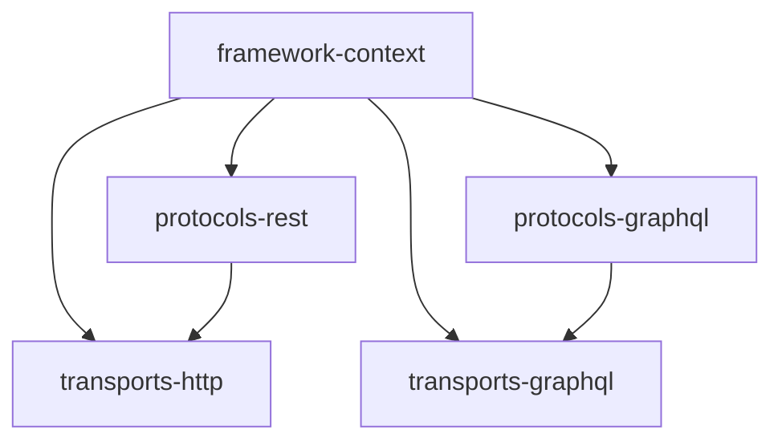
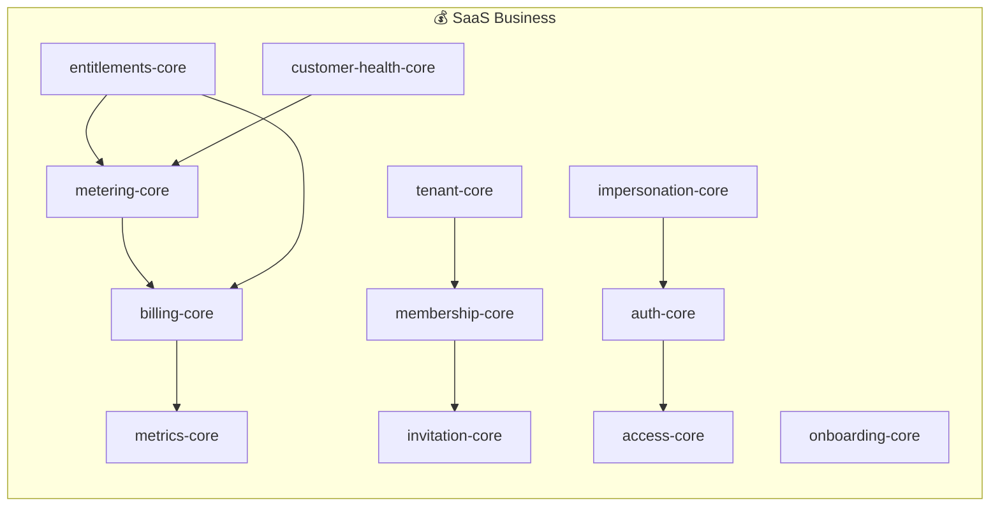

# 🐊 Croco Framework

**Move fast, build robustly.**  
Croco는 AWS Lambda와 API Gateway를 1급 시민(First-class Citizen)으로 지원하는 Node.js 기반의 **Opinionated(주견이 뚜렷한)** 프레임워크입니다.  
복잡한 비즈니스 로직을 다루는 엔터프라이즈 환경부터 빠른 배포가 필요한 스타트업까지, DDD(Domain-Driven Design) 패턴과 강력한 타입 안전성을 제공합니다.

---

## ✨ 한 줄 소개

AWS Lambda에 최적화된 Node.js 기반 **Opinionated(주견이 뚜렷한)** 프레임워크입니다. DDD(Domain-Driven Design) 패턴과 강력한 타입 안전성을 통해 빠르고 견고하게 서비스를 구축할 수 있습니다.

---

## 🎯 왜 Croco인가?

Croco는 AWS Lambda 지향 TypeScript 애플리케이션에서 HTTP 진입점, DDD 이벤트, 트랜잭션, SaaS 지표/미터링, 관찰 가능성을 하나의 일관된 데코레이터·타입 시스템으로 묶어 주는 opinionated TypeScript 프레임워크입니다.

기존의 Node.js 프레임워크들은 유연하지만, 대규모 프로젝트에서 아키텍처의 일관성을 유지하기 어렵습니다. Croco는 다음과 같은 문제를 해결합니다:

- **정형화된 4계층 구조**: 팀 간 코드 일관성 유지
- **AWS Lambda 환경에 최적화된 경량 실행 어댑터**
- **이벤트 주도 아키텍처(EDA)와 Unit of Work 트랜잭션 관리 기본 제공**
- **타입 정의만으로 REST/GraphQL API와 문서 자동 생성 지원**

### 🆚 설계 철학 비교

|                     | Croco                          | NestJS                 | Hono                   | tRPC           |
| ------------------- | ------------------------------ | ---------------------- | ---------------------- | -------------- |
| 주 타겟             | AWS Lambda + SaaS 도메인       | 엔터프라이즈 일반 서버 | 초경량 엣지/멀티런타임 | 타입 안전 RPC  |
| 아키텍처            | 4계층 의견있는 구조            | 모듈 기반 MVC          | 라우터 중심            | 스키마리스 RPC |
| SaaS 빌딩 블록      | 빌링/메트릭/멤버십/미터링 제공 | 별도 통합 필요         | 별도 통합 필요         | 별도 통합 필요 |
| DDD 이벤트/트랜잭션 | 기본 내장                      | 별도 통합 필요         | ❌                     | ❌             |
| Lambda 최적화       | ✅ lambdaHandler 내장          | ❌                     | ✅ (별도 어댑터)       | ❌             |

> 위 표는 Croco의 설계 중심을 설명하며, 성능 수치나 경쟁사 부정평가는 포함하지 않습니다.

---

## 🏗 아키텍처

Croco는 관심사의 분리를 위해 **4계층 구조**를 따릅니다.





### 1. framework (기반 계층)

프레임워크의 뿌리가 되는 계층입니다.

- **framework-context**: 공통 Context 인터페이스, DI 컨테이너, 데코레이터 메타데이터 저장소를 포함합니다.

### 2. Protocols (정의 계층)

비즈니스 로직의 인터페이스를 정의합니다.

- **protocols-rest**: `@Controller`, `@Get` 등 REST API 정의를 위한 데코레이터를 제공합니다.
- **protocols-graphql**: **Yoga** 런타임을 활용한 Code-first GraphQL 정의를 지원합니다.

### 3. Transports (실행 계층)

정의된 프로토콜을 실제로 실행하는 어댑터입니다.

- **transports-http**: **Hono** 기반의 고성능 실행 엔진입니다. AWS Lambda (API Gateway v2) 핸들러 생성기를 내장하고 있습니다.
- **transports-graphql**: GraphQL 프로토콜을 실제 런타임에 연결하는 실행 어댑터를 제공합니다.

### 4. Integrations (통합 계층)

외부 시스템과의 연동을 추상화합니다.

- **integrations-posthog**: **PostHog**와 통합되어 제품 분석 이벤트 수집을 지원합니다.

---

## 🚀 Quick Start

> Lambda 기반 REST API를 빠르게 시작하세요.
>
> **첫 번째 프로젝트 생성**:
>
> ```bash
> npx create-croco-app@latest my-project --preset ddd-api --backend-deploy lambda
> cd my-project && pnpm install && pnpm dev
> ```
>
> **Route A (Scaffold)**: [Getting Started Guide](packages/docs/src/content/docs/en/guides/getting-started.mdx)에서 scaffold부터 Auth, Metering, Lambda 배포까지 단계별로 SaaS API를 구축하세요.
>
> **Route B (Example)**: [Quick Start Example](examples/quick-start-lambda/)에서 Auth와 Metering이 포함된 완성된 Lambda API를 `pnpm dev`로 바로 실행하세요.

#### 패키지 성숙도 안내

Croco의 package count, group, maturity metadata는 아래 [패키지 카탈로그](#-패키지-카탈로그) 섹션에서 자동 생성됩니다. 사용 전 상태를 확인하세요.

- 🟢 production-ready — 안정화, 적극 사용 권장
- 🟡 beta — 기능 완성, 실사용 검증 중
- 🔴 alpha/WIP — 개발 중, 사용 시 주의 필요
- ⚠️ deprecated — 대체 패키지 존재, 마이그레이션 권장

### 📂 Package Grouping

Croco package grouping은 `docs/package-catalog.json`의 group metadata와 `packages/*/package.json`에서 생성됩니다. README의 카탈로그가 drift되면 `pnpm docs:catalog:check`가 실패합니다.

#### 기여자를 위한 읽기 순서

1. `framework-context` — DI 컨테이너, 데코레이터 기반
2. `problems-core` — 에러 처리 패턴
3. `protocols-*` → `transports-*` — API 정의 및 실행
4. 도메인 패키지 (`*-core`) — 비즈니스 로직
5. Provider 패키지 (`*-polar`, `*-clerk` 등) — 외부 연동

---

## 📊 벤치마크 및 성능 측정

Croco는 Lambda 콜드스타트 및 실행 성능을 지속적으로 측정하고 있습니다.

벤치마크는 `benchmarks/` 디렉토리에서 관리되며, 다음과 같은 정보를 포함합니다:

- 측정 방법론 및 시나리오 설명
- 최신 기준선(baseline) 및 임계값(threshold) 데이터
- CI 상에서 warning-only 모드로 동작 (현재 enforce 아님)

자세한 내용은 [benchmark-gate-transition.md](benchmarks/benchmark-gate-transition.md)를 참조하세요.

---

## ⚡ 주요 기능

### 도메인 이벤트 (DDD)

Aggregate Root에서 이벤트를 발행하고, 타입 안전한 핸들러에서 이를 처리합니다.

```typescript
@RegisterEventHandler(OrderPlacedEvent)
class OrderPlacedHandler implements EventHandler<OrderPlacedEvent> {
  async handle(event: OrderPlacedEvent) {
    // 비즈니스 로직 처리
  }
}
```

### 트랜잭션 관리 (Unit of Work)

데코레이터 하나로 트랜잭션 경계를 설정하고, `AsyncLocalStorage`를 통해 컨텍스트를 전파합니다.

```typescript
@Service()
class OrderService {
  @Transactional()
  async placeOrder(dto: CreateOrderDto) {
    // 여러 리포지토리가 동일한 트랜잭션 내에서 동작합니다.
  }
}
```

### 문제 상세화 (Problem Details)

RFC 7807 표준을 따르는 일관된 에러 응답 형식을 제공합니다.

```typescript
throw Problem.notFound("user/not-found", "사용자를 찾을 수 없습니다.");
```

---

## 🚀 시작하기

### 설치

```bash
# 모노레포 클론
git clone https://github.com/croco-dev/framework.git
cd framework

# 의존성 설치
pnpm install

# 빌드
pnpm build
```

### 빠른 시작 - HTTP API 서버

```typescript
import { Controller, Get, Post, Body } from "@croco/protocols-rest";
import { createApp } from "@croco/transports-http";
import { Component } from "@croco/framework-context";
import { Problem } from "@croco/problems-core";

@Component()
@Controller("/users")
class UserController {
  @Get("/")
  async list() {
    return [{ id: 1, name: "John" }];
  }

  @Post("/")
  async create(@Body() body: { name: string }) {
    return { id: 2, name: body.name };
  }
}

const app = createApp({
  controllers: [UserController],
});

export const handler = app.lambdaHandler(); // AWS Lambda
// app.listen(3000); // Node.js 서버
```

### 핵심 패키지 사용법

#### 1. 의존성 주입 (@croco/framework-context)

```typescript
import { Component, Container } from "@croco/framework-context";

@Component()
class UserService {
  async getUser(id: string) {
    return { id, name: "John" };
  }
}

// 자동 singleton 등록, 생성자 주입 지원
```

#### 2. 에러 처리 (@croco/problems-core)

```typescript
import { Problem, NotFoundProblem } from "@croco/problems-core";

// RFC 7807 Problem 기반 에러
throw new NotFoundProblem("User", userId);

// 자동으로 404 + application/problem+json 응답
```

#### 3. 재시도 & 서킷브레이커 (@croco/retry-core)

```typescript
import { Retryable, Recover } from "@croco/retry-core";

class ExternalApiService {
  @Retryable({ maxAttempts: 3, backoff: "exponential" })
  async fetchData(): Promise<Data> {
    return fetch("https://api.example.com/data");
  }

  @Recover
  async recoverFromFailure(error: Error): Promise<Data> {
    return { cached: true };
  }
}
```

#### 4. 분산 추적 (@croco/telemetry-api)

```typescript
import { Trace } from "@croco/telemetry-api";

class OrderService {
  @Trace({ name: "order.create" })
  async createOrder(dto: CreateOrderDto) {
    // 자동으로 OpenTelemetry Span 생성
  }
}
```

## 🗺️ 로드맵 — SaaS-first를 향하여

Croco가 **완전한 SaaS 프레임워크**가 되기 위해 계획 중인 기능들입니다.

### 🏗️ Phase 1: 인프라 강화 (Q2 2025)

- [ ] **billing-core**: 다중 통화, 세금 계산, 프리 티어 지원
- [ ] **subscription-drizzle**: Stripe + Drizzle 통합 구독 관리
- [ ] **metering-drizzle**: Redis + Drizzle 하이브리드 사용량 추적

### 🔐 Phase 2: 인증/인가 (Q3 2025)

- [ ] **auth-clerk**: Clerk 통합 (소셜 로그인, 조직 관리)
- [ ] **auth-better-auth**: Better Auth + Drizzle 셀프 호스팅 인증
- [ ] **access-drizzle**: Fine-grained ACL 구현체

### 🚀 Phase 3: 서버리스 확장 (Q4 2025)

- [ ] **batch-qstash**: QStash 기반 비동기 배치 처리
- [ ] **tasks-qstash**: QStash 태스크 큐
- [ ] **notification-email**: Resend 이메일 발송

### 🧠 Phase 4: AI/LLM (2026)

- [ ] **llm-agent**: 에이전트 패턴, 도구 호출, 멀티턴 대화
- [ ] **llm-rag**: 벡터 DB 통합, 문서 검색 증강
- [ ] **llm-evals**: LLM 평가 프레임워크

---

**기여 환영**: 각 패키지의 GitHub Issues에서 `good first issue`를 확인하세요!

---

<!-- CROCO:PACKAGE-CATALOG:START -->

## 📦 패키지 카탈로그

> 이 섹션은 `pnpm docs:catalog:write`로 생성됩니다. 패키지 이름과 경로는 `packages/*/package.json`에서 읽고, 그룹/성숙도는 `docs/package-catalog.json`에서 관리합니다.

현재 카탈로그는 **98개 public package**를 추적합니다. Private package 1개는 publish 카탈로그에서 제외됩니다. 문서 커버리지 상세는 [docs/package-docs-report.md](docs/package-docs-report.md)를 확인하세요.

### Package Groups

| 그룹         | 역할                                                                                       | 패키지 수 |
| ------------ | ------------------------------------------------------------------------------------------ | --------: |
| Core         | Framework primitives, context, reliability, transactions, and cross-cutting core utilities |        21 |
| Domain       | Business-domain APIs and package-level abstractions                                        |        24 |
| Provider     | Concrete datastore, SaaS provider, and external service adapters                           |        25 |
| Integration  | Analytics, feature-flag, and observability integrations                                    |         5 |
| Protocol     | API protocol definitions and code generation                                               |         6 |
| Transport    | Runtime adapters that execute protocol routes                                              |         3 |
| Presentation | Frontend, SSR, and presentation-layer adapters                                             |         5 |
| Tooling      | CLIs, scaffolds, presets, migration tools, and build-time helpers                          |         8 |
| Docs         | Documentation site and generated reference content                                         |         1 |

### Maturity Guide

| 상태                | 의미                                | 패키지 수 |
| ------------------- | ----------------------------------- | --------: |
| 🟢 production-ready | 안정화, 적극 사용 권장              |        23 |
| 🟡 beta             | 기능 완성, 실사용 검증 중           |        44 |
| 🔴 alpha/WIP        | 개발 중, 사용 시 주의 필요          |        31 |
| ⚠️ deprecated       | 대체 패키지 존재, 마이그레이션 권장 |         0 |

### 🟢 production-ready

| 패키지                      | 그룹        | 디렉터리                      | 문서               |
| --------------------------- | ----------- | ----------------------------- | ------------------ |
| `@croco/dataloader-core`    | Core        | `packages/dataloader-core`    | README, tests      |
| `@croco/events-core`        | Core        | `packages/events-core`        | README, API, tests |
| `@croco/framework-context`  | Core        | `packages/framework-context`  | README, API, tests |
| `@croco/problems-core`      | Core        | `packages/problems-core`      | README, API, tests |
| `@croco/repository-core`    | Core        | `packages/repository-core`    | README, tests      |
| `@croco/retry-core`         | Core        | `packages/retry-core`         | README, API, tests |
| `@croco/tx-core`            | Core        | `packages/tx-core`            | README, tests      |
| `@croco/tx-drizzle`         | Core        | `packages/tx-drizzle`         | README, tests      |
| `@croco/audit-core`         | Domain      | `packages/audit-core`         | README, tests      |
| `@croco/auth-core`          | Domain      | `packages/auth-core`          | README, API, tests |
| `@croco/billing-core`       | Domain      | `packages/billing-core`       | README, tests      |
| `@croco/invitation-core`    | Domain      | `packages/invitation-core`    | README, tests      |
| `@croco/llm-core`           | Domain      | `packages/llm-core`           | README, API, tests |
| `@croco/llm-metering`       | Domain      | `packages/llm-metering`       | README, tests      |
| `@croco/membership-core`    | Domain      | `packages/membership-core`    | README, tests      |
| `@croco/metering-core`      | Domain      | `packages/metering-core`      | README, API, tests |
| `@croco/metrics-core`       | Domain      | `packages/metrics-core`       | README, tests      |
| `@croco/ratelimit-core`     | Domain      | `packages/ratelimit-core`     | README, API, tests |
| `@croco/search-core`        | Domain      | `packages/search-core`        | README, tests      |
| `@croco/telemetry-api`      | Integration | `packages/telemetry-api`      | README, API, tests |
| `@croco/telemetry-sdk-node` | Integration | `packages/telemetry-sdk-node` | README, API, tests |
| `@croco/protocols-rest`     | Protocol    | `packages/protocols-rest`     | README, tests      |
| `@croco/transports-http`    | Transport   | `packages/transports-http`    | README, API, tests |

### 🟡 beta

| 패키지                        | 그룹         | 디렉터리                        | 문서               |
| ----------------------------- | ------------ | ------------------------------- | ------------------ |
| `@croco/cache-core`           | Core         | `packages/cache-core`           | README, tests      |
| `@croco/diagnostics-core`     | Core         | `packages/diagnostics-core`     | tests              |
| `@croco/events-inmemory`      | Core         | `packages/events-inmemory`      | README, API, tests |
| `@croco/events-tx`            | Core         | `packages/events-tx`            | tests              |
| `@croco/framework-config`     | Core         | `packages/framework-config`     | README, tests      |
| `@croco/framework-logger`     | Core         | `packages/framework-logger`     | README, tests      |
| `@croco/framework-module`     | Core         | `packages/framework-module`     | tests              |
| `@croco/framework-preset`     | Core         | `packages/framework-preset`     | tests              |
| `@croco/framework-routes`     | Core         | `packages/framework-routes`     | tests              |
| `@croco/gid-core`             | Core         | `packages/gid-core`             | README, tests      |
| `@croco/health-core`          | Core         | `packages/health-core`          | README, tests      |
| `@croco/pagination-core`      | Core         | `packages/pagination-core`      | README, tests      |
| `@croco/tenant-core`          | Core         | `packages/tenant-core`          | README, tests      |
| `@croco/docs`                 | Docs         | `packages/docs`                 | README             |
| `@croco/access-core`          | Domain       | `packages/access-core`          | README, tests      |
| `@croco/customer-health-core` | Domain       | `packages/customer-health-core` | README, tests      |
| `@croco/entitlements-core`    | Domain       | `packages/entitlements-core`    | README, tests      |
| `@croco/execution-core`       | Domain       | `packages/execution-core`       | README, tests      |
| `@croco/features-core`        | Domain       | `packages/features-core`        | tests              |
| `@croco/impersonation-core`   | Domain       | `packages/impersonation-core`   | README, tests      |
| `@croco/notifications-core`   | Domain       | `packages/notifications-core`   | tests              |
| `@croco/onboarding-core`      | Domain       | `packages/onboarding-core`      | README, tests      |
| `@croco/storage-core`         | Domain       | `packages/storage-core`         | tests              |
| `@croco/tasks-core`           | Domain       | `packages/tasks-core`           | README, tests      |
| `@croco/triggers-core`        | Domain       | `packages/triggers-core`        | README, tests      |
| `@croco/features-posthog`     | Integration  | `packages/features-posthog`     | README, tests      |
| `@croco/integrations-posthog` | Integration  | `packages/integrations-posthog` | tests              |
| `@croco/meta-vite`            | Presentation | `packages/meta-vite`            | README, tests      |
| `@croco/presentation-preset`  | Presentation | `packages/presentation-preset`  | tests              |
| `@croco/openapi-spec`         | Protocol     | `packages/openapi-spec`         | tests              |
| `@croco/protocols-core`       | Protocol     | `packages/protocols-core`       | tests              |
| `@croco/protocols-graphql`    | Protocol     | `packages/protocols-graphql`    | tests              |
| `@croco/protocols-trpc`       | Protocol     | `packages/protocols-trpc`       | tests              |
| `@croco/rpc-codegen`          | Protocol     | `packages/rpc-codegen`          | tests              |
| `@croco/billing-polar`        | Provider     | `packages/billing-polar`        | README, tests      |
| `@croco/storage-r2`           | Provider     | `packages/storage-r2`           | README, tests      |
| `@croco/cli`                  | Tooling      | `packages/cli`                  | README, tests      |
| `create-croco-app`            | Tooling      | `packages/create-croco-app`     | tests              |
| `@croco/esbuild-plugin`       | Tooling      | `packages/esbuild-plugin`       | README, tests      |
| `@croco/preset-cloudflare`    | Tooling      | `packages/preset-cloudflare`    | tests              |
| `@croco/preset-lambda`        | Tooling      | `packages/preset-lambda`        | tests              |
| `@croco/preset-node`          | Tooling      | `packages/preset-node`          | tests              |
| `@croco/testing`              | Tooling      | `packages/testing`              | README, tests      |
| `@croco/transports-graphql`   | Transport    | `packages/transports-graphql`   | tests              |

### 🔴 alpha/WIP

| 패키지                                 | 그룹         | 디렉터리                                 | 문서          |
| -------------------------------------- | ------------ | ---------------------------------------- | ------------- |
| `@croco/analytics-core`                | Domain       | `packages/analytics-core`                | tests         |
| `@croco/batch-core`                    | Domain       | `packages/batch-core`                    | README, tests |
| `@croco/analytics-posthog`             | Integration  | `packages/analytics-posthog`             | README, tests |
| `@croco/frontend-cloudflare`           | Presentation | `packages/frontend-cloudflare`           | README, tests |
| `@croco/frontend-react`                | Presentation | `packages/frontend-react`                | README, tests |
| `@croco/frontend-vite`                 | Presentation | `packages/frontend-vite`                 | README, tests |
| `@croco/access-drizzle`                | Provider     | `packages/access-drizzle`                | README, tests |
| `@croco/audit-drizzle`                 | Provider     | `packages/audit-drizzle`                 | README, tests |
| `@croco/auth-better-auth`              | Provider     | `packages/auth-better-auth`              | README, tests |
| `@croco/auth-clerk`                    | Provider     | `packages/auth-clerk`                    | README, tests |
| `@croco/auth-drizzle`                  | Provider     | `packages/auth-drizzle`                  | README, tests |
| `@croco/batch-qstash`                  | Provider     | `packages/batch-qstash`                  | README, tests |
| `@croco/customer-health-drizzle`       | Provider     | `packages/customer-health-drizzle`       | README, tests |
| `@croco/entitlements-drizzle`          | Provider     | `packages/entitlements-drizzle`          | README, tests |
| `@croco/execution-drizzle`             | Provider     | `packages/execution-drizzle`             | README, tests |
| `@croco/invitation-drizzle`            | Provider     | `packages/invitation-drizzle`            | README, tests |
| `@croco/membership-drizzle`            | Provider     | `packages/membership-drizzle`            | README, tests |
| `@croco/metering-drizzle`              | Provider     | `packages/metering-drizzle`              | README, tests |
| `@croco/metering-upstash`              | Provider     | `packages/metering-upstash`              | README, tests |
| `@croco/metrics-billing`               | Provider     | `packages/metrics-billing`               | README, tests |
| `@croco/notifications-resend`          | Provider     | `packages/notifications-resend`          | README, tests |
| `@croco/onboarding-drizzle`            | Provider     | `packages/onboarding-drizzle`            | README, tests |
| `@croco/ratelimit-upstash`             | Provider     | `packages/ratelimit-upstash`             | README, tests |
| `@croco/search-drizzle`                | Provider     | `packages/search-drizzle`                | README, tests |
| `@croco/search-meilisearch`            | Provider     | `packages/search-meilisearch`            | README, tests |
| `@croco/storage-cloudflare`            | Provider     | `packages/storage-cloudflare`            | README, tests |
| `@croco/storage-cloudinary`            | Provider     | `packages/storage-cloudinary`            | README, tests |
| `@croco/tasks-qstash`                  | Provider     | `packages/tasks-qstash`                  | README, tests |
| `@croco/triggers-qstash`               | Provider     | `packages/triggers-qstash`               | tests         |
| `@croco/migration-runner`              | Tooling      | `packages/migration-runner`              | tests         |
| `@croco/transports-cloudflare-workers` | Transport    | `packages/transports-cloudflare-workers` | tests         |

### Documentation Gate

- `pnpm docs:catalog:check`는 README 카탈로그와 문서 커버리지 리포트 drift를 검증합니다.
- 신규 public package는 `docs/package-catalog.json`에 그룹/성숙도 metadata가 있어야 합니다.
- 신규 public package의 README, API docs, tests 누락은 `docs/package-docs-baseline.json`에 없는 한 실패합니다.

<!-- CROCO:PACKAGE-CATALOG:END -->

---

## 🛠 개발 환경

### 코드 품질 도구

- **Biome**: 린팅 및 포맷팅 (`quoteStyle: 'single'`, `lineWidth: 120`)
- **TypeScript**: 엄격 모드 + 데코레이터 지원
- **Vitest**: 테스트 프레임워크

### 주요 명령어

```bash
pnpm install          # 의존성 설치
pnpm build            # 모든 패키지 빌드
pnpm lint             # Biome 린트 검사
pnpm check            # Biome 전체 검사 (lint + format)
pnpm format           # Biome 포맷팅
pnpm test             # 테스트 실행
pnpm typecheck        # TypeScript 타입 검사
```

### Git Hooks (Lefthook)

- **Pre-commit**: Biome 자동 수정
- **Pre-push**: 테스트 및 타입 검사

---

## 🚢 배포 전략

Croco는 **AWS Lambda**를 최우선으로 고려합니다.

- **Fast Startup**: 불필요한 의존성을 배제하고 트리쉐이킹에 최적화된 빌드를 제공합니다.
- **API Gateway v2 Support**: 고성능 HTTP API를 위한 어댑터를 기본 제공합니다.
- **pnpm + Turbo**: 고성능 빌드 파이프라인을 통해 배포 속도를 극대화합니다.

```bash
pnpm run deploy -- --otp <otp>
```

---

## 🤝 기여하기

기여 방법, 개발 환경 설정, 코드 스타일, Git 워크플로우는 [CONTRIBUTING.md](./CONTRIBUTING.md)를 참고하세요.

---

## 📄 라이선스

MIT License. Copyright (c) 2026 Croco Team.
