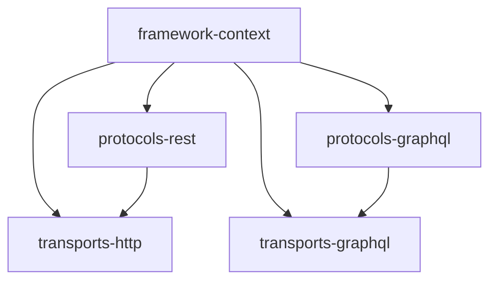
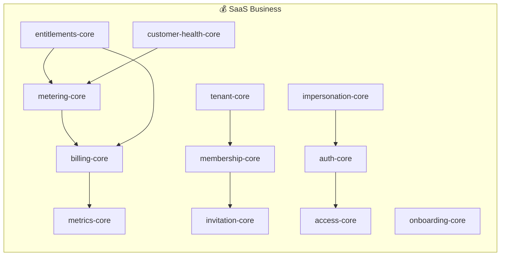

# 🐊 Croco Framework

**Move fast, build robustly.**  
Croco는 AWS Lambda와 API Gateway를 1급 시민(First-class Citizen)으로 지원하는 Node.js 기반의 **Opinionated(주견이 뚜렷한)** 프레임워크입니다.  
복잡한 비즈니스 로직을 다루는 엔터프라이즈 환경부터 빠른 배포가 필요한 스타트업까지, DDD(Domain-Driven Design) 패턴과 강력한 타입 안전성을 제공합니다.

---

## ✨ 한 줄 소개

AWS Lambda에 최적화된 Node.js 기반 **Opinionated(주견이 뚜렷한)** 프레임워크입니다. DDD(Domain-Driven Design) 패턴과 강력한 타입 안전성을 통해 빠르고 견고하게 서비스를 구축할 수 있습니다.

---

## 🎯 왜 Croco인가?

Croco는 AWS Lambda 지향 TypeScript 애플리케이션에서 HTTP 진입점, DDD 이벤트, 트랜잭션, SaaS 지표/미터링, 관찰 가능성을 하나의 일관된 데코레이터·타입 시스템으로 묶어 주는 opinionated TypeScript 프레임워크입니다.

기존의 Node.js 프레임워크들은 유연하지만, 대규모 프로젝트에서 아키텍처의 일관성을 유지하기 어렵습니다. Croco는 다음과 같은 문제를 해결합니다:

- **정형화된 4계층 구조**: 팀 간 코드 일관성 유지
- **AWS Lambda 환경에 최적화된 경량 실행 어댑터**
- **이벤트 주도 아키텍처(EDA)와 Unit of Work 트랜잭션 관리 기본 제공**
- **타입 정의만으로 REST/GraphQL API와 문서 자동 생성 지원**

### 🆚 설계 철학 비교

|                     | Croco                          | NestJS                 | Hono                   | tRPC           |
| ------------------- | ------------------------------ | ---------------------- | ---------------------- | -------------- |
| 주 타겟             | AWS Lambda + SaaS 도메인       | 엔터프라이즈 일반 서버 | 초경량 엣지/멀티런타임 | 타입 안전 RPC  |
| 아키텍처            | 4계층 의견있는 구조            | 모듈 기반 MVC          | 라우터 중심            | 스키마리스 RPC |
| SaaS 빌딩 블록      | 빌링/메트릭/멤버십/미터링 제공 | 별도 통합 필요         | 별도 통합 필요         | 별도 통합 필요 |
| DDD 이벤트/트랜잭션 | 기본 내장                      | 별도 통합 필요         | ❌                     | ❌             |
| Lambda 최적화       | ✅ lambdaHandler 내장          | ❌                     | ✅ (별도 어댑터)       | ❌             |

> 위 표는 Croco의 설계 중심을 설명하며, 성능 수치나 경쟁사 부정평가는 포함하지 않습니다.

---

## 🏗 아키텍처

Croco는 관심사의 분리를 위해 **4계층 구조**를 따릅니다.





### 1. framework (기반 계층)

프레임워크의 뿌리가 되는 계층입니다.

- **framework-context**: 공통 Context 인터페이스, DI 컨테이너, 데코레이터 메타데이터 저장소를 포함합니다.

### 2. Protocols (정의 계층)

비즈니스 로직의 인터페이스를 정의합니다.

- **protocols-rest**: `@Controller`, `@Get` 등 REST API 정의를 위한 데코레이터를 제공합니다.
- **protocols-graphql**: **Yoga** 런타임을 활용한 Code-first GraphQL 정의를 지원합니다.

### 3. Transports (실행 계층)

정의된 프로토콜을 실제로 실행하는 어댑터입니다.

- **transports-http**: **Hono** 기반의 고성능 실행 엔진입니다. AWS Lambda (API Gateway v2) 핸들러 생성기를 내장하고 있습니다.
- **transports-graphql**: GraphQL 프로토콜을 실제 런타임에 연결하는 실행 어댑터를 제공합니다.

### 4. Integrations (통합 계층)

외부 시스템과의 연동을 추상화합니다.

- **integrations-posthog**: **PostHog**와 통합되어 제품 분석 이벤트 수집을 지원합니다.

---

## 🚀 Quick Start

> Lambda 기반 REST API를 빠르게 시작하세요.
>
> **첫 번째 프로젝트 생성**:
>
> ```bash
> npx create-croco-app@latest my-project --preset ddd-api --backend-deploy lambda
> cd my-project && pnpm install && pnpm dev
> ```
>
> **Route A (Scaffold)**: [Getting Started Guide](packages/docs/src/content/docs/en/guides/getting-started.mdx)에서 scaffold부터 Auth, Metering, Lambda 배포까지 단계별로 SaaS API를 구축하세요.
>
> **Route B (Example)**: [Quick Start Example](examples/quick-start-lambda/)에서 Auth와 Metering이 포함된 완성된 Lambda API를 `pnpm dev`로 바로 실행하세요.

#### 패키지 성숙도 안내

Croco는 80여 개의 패키지로 구성되며, 패키지마다 성숙도가 다릅니다. 사용 전 상태를 확인하세요.

- 🟢 production-ready — 안정화, 적극 사용 권장
- 🟡 beta — 기능 완성, 실사용 검증 중
- 🔴 alpha/WIP — 개발 중, 사용 시 주의 필요
- ⚠️ deprecated — 대체 패키지 존재, 마이그레이션 권장

### 📂 Package Grouping

Croco는 80여 개의 패키지를 다음 6개 그룹으로 분류합니다.

| 그룹            | 역할                    | 대표 패키지                                                       |
| --------------- | ----------------------- | ----------------------------------------------------------------- |
| **Core**        | 프레임워크 기반 계층    | `framework-context`, `problems-core`, `events-core`, `retry-core` |
| **Domain**      | 비즈니스 도메인 로직    | `billing-core`, `metering-core`, `auth-core`, `membership-core`   |
| **Provider**    | 외부 서비스 연동 구현체 | `billing-polar`, `metering-upstash`, `auth-clerk`, `storage-r2`   |
| **Protocol**    | API 인터페이스 정의     | `protocols-rest`, `protocols-graphql`                             |
| **Transport**   | 프로토콜 실행 어댑터    | `transports-http`, `transports-graphql`                           |
| **Integration** | 분석/관찰 가능성 통합   | `integrations-posthog`, `telemetry-api`, `logging-pino`           |

#### 기여자를 위한 읽기 순서

1. `framework-context` — DI 컨테이너, 데코레이터 기반
2. `problems-core` — 에러 처리 패턴
3. `protocols-*` → `transports-*` — API 정의 및 실행
4. 도메인 패키지 (`*-core`) — 비즈니스 로직
5. Provider 패키지 (`*-polar`, `*-clerk` 등) — 외부 연동

---

## 📊 벤치마크 및 성능 측정

Croco는 Lambda 콜드스타트 및 실행 성능을 지속적으로 측정하고 있습니다.

벤치마크는 `benchmarks/` 디렉토리에서 관리되며, 다음과 같은 정보를 포함합니다:

- 측정 방법론 및 시나리오 설명
- 최신 기준선(baseline) 및 임계값(threshold) 데이터
- CI 상에서 warning-only 모드로 동작 (현재 enforce 아님)

자세한 내용은 [benchmark-gate-transition.md](benchmarks/benchmark-gate-transition.md)를 참조하세요.

---

## ⚡ 주요 기능

### 도메인 이벤트 (DDD)

Aggregate Root에서 이벤트를 발행하고, 타입 안전한 핸들러에서 이를 처리합니다.

```typescript
@RegisterEventHandler(OrderPlacedEvent)
class OrderPlacedHandler implements EventHandler<OrderPlacedEvent> {
  async handle(event: OrderPlacedEvent) {
    // 비즈니스 로직 처리
  }
}
```

### 트랜잭션 관리 (Unit of Work)

데코레이터 하나로 트랜잭션 경계를 설정하고, `AsyncLocalStorage`를 통해 컨텍스트를 전파합니다.

```typescript
@Service()
class OrderService {
  @Transactional()
  async placeOrder(dto: CreateOrderDto) {
    // 여러 리포지토리가 동일한 트랜잭션 내에서 동작합니다.
  }
}
```

### 문제 상세화 (Problem Details)

RFC 7807 표준을 따르는 일관된 에러 응답 형식을 제공합니다.

```typescript
throw Problem.notFound("user/not-found", "사용자를 찾을 수 없습니다.");
```

---

## 🚀 시작하기

### 설치

```bash
# 모노레포 클론
git clone https://github.com/croco-dev/framework.git
cd framework

# 의존성 설치
pnpm install

# 빌드
pnpm build
```

### 빠른 시작 - HTTP API 서버

```typescript
import { Controller, Get, Post, Body } from "@croco/protocols-rest";
import { createApp } from "@croco/transports-http";
import { Component } from "@croco/framework-context";
import { Problem } from "@croco/problems-core";

@Component()
@Controller("/users")
class UserController {
  @Get("/")
  async list() {
    return [{ id: 1, name: "John" }];
  }

  @Post("/")
  async create(@Body() body: { name: string }) {
    return { id: 2, name: body.name };
  }
}

const app = createApp({
  controllers: [UserController],
});

export const handler = app.lambdaHandler(); // AWS Lambda
// app.listen(3000); // Node.js 서버
```

### 핵심 패키지 사용법

#### 1. 의존성 주입 (@croco/framework-context)

```typescript
import { Component, Container } from "@croco/framework-context";

@Component()
class UserService {
  async getUser(id: string) {
    return { id, name: "John" };
  }
}

// 자동 singleton 등록, 생성자 주입 지원
```

#### 2. 에러 처리 (@croco/problems-core)

```typescript
import { Problem, NotFoundProblem } from "@croco/problems-core";

// RFC 7807 Problem 기반 에러
throw new NotFoundProblem("User", userId);

// 자동으로 404 + application/problem+json 응답
```

#### 3. 재시도 & 서킷브레이커 (@croco/retry-core)

```typescript
import { Retryable, Recover } from "@croco/retry-core";

class ExternalApiService {
  @Retryable({ maxAttempts: 3, backoff: "exponential" })
  async fetchData(): Promise<Data> {
    return fetch("https://api.example.com/data");
  }

  @Recover
  async recoverFromFailure(error: Error): Promise<Data> {
    return { cached: true };
  }
}
```

#### 4. 분산 추적 (@croco/telemetry-api)

```typescript
import { Trace } from "@croco/telemetry-api";

class OrderService {
  @Trace({ name: "order.create" })
  async createOrder(dto: CreateOrderDto) {
    // 자동으로 OpenTelemetry Span 생성
  }
}
```

## 🗺️ 로드맵 — SaaS-first를 향하여

Croco가 **완전한 SaaS 프레임워크**가 되기 위해 계획 중인 기능들입니다.

### 🏗️ Phase 1: 인프라 강화 (Q2 2025)

- [ ] **billing-core**: 다중 통화, 세금 계산, 프리 티어 지원
- [ ] **subscription-drizzle**: Stripe + Drizzle 통합 구독 관리
- [ ] **metering-drizzle**: Redis + Drizzle 하이브리드 사용량 추적

### 🔐 Phase 2: 인증/인가 (Q3 2025)

- [ ] **auth-clerk**: Clerk 통합 (소셜 로그인, 조직 관리)
- [ ] **auth-better-auth**: Better Auth + Drizzle 셀프 호스팅 인증
- [ ] **access-drizzle**: Fine-grained ACL 구현체

### 🚀 Phase 3: 서버리스 확장 (Q4 2025)

- [ ] **batch-qstash**: QStash 기반 비동기 배치 처리
- [ ] **tasks-qstash**: QStash 태스크 큐
- [ ] **notification-email**: Resend 이메일 발송

### 🧠 Phase 4: AI/LLM (2026)

- [ ] **llm-agent**: 에이전트 패턴, 도구 호출, 멀티턴 대화
- [ ] **llm-rag**: 벡터 DB 통합, 문서 검색 증강
- [ ] **llm-evals**: LLM 평가 프레임워크

---

**기여 환영**: 각 패키지의 GitHub Issues에서 `good first issue`를 확인하세요!

---

## 📦 패키지 카탈로그

### 🟢 Available Now (Production Ready)

| 패키지               | 설명                                                                                 | 상태 |
| -------------------- | ------------------------------------------------------------------------------------ | ---- |
| `framework-context`  | DI 컨테이너, 요청 컨텍스트(AsyncLocalStorage), 데코레이터 기반 컴포넌트 등록         | 🟢   |
| `problems-core`      | RFC 7807 Problem Details 기반 구조화된 에러 처리                                     | 🟢   |
| `events-core`        | 도메인 이벤트 발행/구독, EDA 기반 아키텍처                                           | 🟢   |
| `tx-core`            | AsyncLocalStorage 기반 Unit of Work 트랜잭션 관리                                    | 🟢   |
| `tx-drizzle`         | Drizzle ORM 트랜잭션 어댑터                                                          | 🟢   |
| `retry-core`         | 재시도 정책, 지수 백오프, 서킷브레이커                                               | 🟢   |
| `billing-core`       | 구독, 주문, 결제 도메인 모델 + DDD 이벤트                                            | 🟢   |
| `metering-core`      | @Meter/@Metered 데코레이터, 사용량 측정, Quota, Redis 집계, 멱등성                   | 🟢   |
| `metrics-core`       | SaaS 핵심 지표 계산 엔진 — MRR, LTV, Churn, NRR, GRR, Quick Ratio, Carrying Capacity | 🟢   |
| `membership-core`    | 팀/조직 멤버십 관리, 역할 할당                                                       | 🟢   |
| `invitation-core`    | 이메일/링크 기반 멤버 초대, 토큰 관리, 도메인 정책                                   | 🟢   |
| `llm-core`           | @Llm 데코레이터 기반 LLM 통합 — 생성, 스트리밍, 도구 호출, 임베딩, 구조화 출력       | 🟢   |
| `llm-metering`       | @AiMetered 데코레이터, LLM 토큰 사용량 추적 및 비용 계산                             | 🟢   |
| `telemetry-api`      | @Trace 데코레이터, withSpan, 분산 추적 API                                           | 🟢   |
| `telemetry-sdk-node` | Node.js OpenTelemetry SDK 초기화, Lambda 프리셋                                      | 🟢   |
| `audit-core`         | @Auditable 데코레이터, 감사 로그 추상화                                              | 🟢   |
| `auth-core`          | RBAC 엔진, @RequirePermission 데코레이터, Guard 패턴                                 | 🟢   |
| `ratelimit-core`     | Rate Limiting 추상화 (고정 윈도우, 슬라이딩 윈도우, 토큰 버킷)                       | 🟢   |
| `repository-core`    | 리포지토리 패턴 인터페이스 및 기본 구현                                              | 🟢   |
| `dataloader-core`    | N+1 문제 해결을 위한 배치 로딩                                                       | 🟢   |
| `search-core`        | @Searchable 데코레이터, 검색 엔진 추상화, 한국어 초성/로마자 변환                    | 🟢   |
| `protocols-rest`     | REST API (@Controller, @Get, @Post 등)                                               | 🟢   |
| `transports-http`    | Hono 기반 HTTP 실행 엔진, Lambda 핸들러 생성기                                       | 🟢   |

### 🟡 Beta / Experimental

| 패키지                 | 설명                                                                    | 상태 |
| ---------------------- | ----------------------------------------------------------------------- | ---- |
| `events-inmemory`      | 인메모리 이벤트 버스 구현체                                             | 🟡   |
| `events-tx`            | 트랜잭션 연동 이벤트 발행 (outbox 패턴)                                 | 🟡   |
| `cache-core`           | 캐시 추상화 레이어                                                      | 🟡   |
| `pagination-core`      | 커서/오프셋 기반 페이지네이션 유틸리티                                  | 🟡   |
| `gid-core`             | ULID 기반 타입 안전 Prefix ID 생성                                      | 🟡   |
| `health-core`          | 헬스체크 엔드포인트 및 의존성 상태 확인                                 | 🟡   |
| `entitlements-core`    | 기능 사용권 관리 — Boolean/Metered/Static entitlement, Guard, Plan 매핑 | 🟡   |
| `customer-health-core` | 테넌트 건강 점수 — Signal 수집, 가중 평균, 상태 전이 이벤트             | 🟡   |
| `impersonation-core`   | 관리자 대리 접속 — 세션 관리, Guard, 감사 추적                          | 🟡   |
| `tenant-core`          | 멀티테넌시 컨텍스트, 테넌트 격리                                        | 🟡   |
| `onboarding-core`      | 사용자/팀 온보딩 단계 추적                                              | 🟡   |
| `storage-core`         | 파일 스토리지 추상화 (업로드, 다운로드, 삭제)                           | 🟡   |
| `storage-r2`           | Cloudflare R2 스토리지 구현체                                           | 🟡   |
| `access-core`          | Fine-grained Access Control (ACL) 엔진                                  | 🟡   |
| `protocols-graphql`    | GraphQL 코드-first 정의 (Yoga 런타임)                                   | 🟡   |
| `transports-graphql`   | GraphQL 프로토콜 실행 어댑터                                            | 🟡   |
| `integrations-posthog` | PostHog 분석 이벤트 수집                                                | 🟡   |
| `features-core`        | 기능 플래그 관리                                                        | 🟡   |
| `features-posthog`     | PostHog 기반 기능 플래그 제공자                                         | 🟡   |
| `tasks-core`           | 태스크 큐 추상화                                                        | 🟡   |
| `triggers-core`        | 이벤트 트리거 추상화                                                    | 🟡   |
| `execution-core`       | 실행 추상화 레이어                                                      | 🟡   |
| `framework-config`     | 설정 관리                                                               | 🟡   |
| `framework-logger`     | 프레임워크 로깅 유틸리티                                                | 🟡   |
| `notifications-core`   | 알림 추상화, 채널 라우팅, 템플릿 엔진                                   | 🟡   |
| `shared`               | 공유 유틸리티                                                           | 🟡   |
| `create-croco-app`     | Croco 프로젝트 생성기                                                   | 🟡   |
| `esbuild-plugin`       | Esbuild 플러그인                                                        | 🟡   |
| `docs`                 | Starlight 기반 API 문서 사이트                                          | 🟡   |
| `billing-polar`        | Polar 결제 플랫폼 연동 (checkout, webhook)                              | 🟡   |

### 🔴 Alpha / WIP

| 패키지                          | 설명                              | 상태 |
| ------------------------------- | --------------------------------- | ---- |
| `metering-upstash`              | Upstash Redis 미터링 구현체       | 🔴   |
| `metrics-billing`               | Billing → Metrics 자동 파이프라인 | 🔴   |
| `entitlements-drizzle`          | Drizzle 구현체                    | 🔴   |
| `customer-health-drizzle`       | Drizzle 구현체                    | 🔴   |
| `membership-drizzle`            | Drizzle 구현체                    | 🔴   |
| `invitation-drizzle`            | Drizzle 구현체                    | 🔴   |
| `onboarding-drizzle`            | Drizzle 구현체                    | 🔴   |
| `ratelimit-upstash`             | Upstash Rate Limit 구현체         | 🔴   |
| `search-drizzle`                | Drizzle 기반 DB 검색 구현체       | 🔴   |
| `search-meilisearch`            | Meilisearch 전문 검색 연동        | 🔴   |
| `storage-cloudflare`            | Cloudflare Images 연동            | 🔴   |
| `storage-cloudinary`            | Cloudinary 이미지/동영상 관리     | 🔴   |
| `audit-drizzle`                 | Drizzle 기반 감사 로그 저장소     | 🔴   |
| `metering-drizzle`              | Drizzle 기반 계량 데이터 저장소   | 🔴   |
| `analytics-core`                | 이벤트 추적, 분석 어댑터 추상화   | 🔴   |
| `analytics-posthog`             | PostHog 분석 어댑터               | 🔴   |
| `auth-drizzle`                  | Drizzle 기반 권한 저장소          | 🔴   |
| `auth-clerk`                    | Clerk 인증 연동                   | 🔴   |
| `auth-better-auth`              | Better Auth 인증 연동             | 🔴   |
| `access-drizzle`                | Drizzle 기반 ACL 제공자           | 🔴   |
| `transports-cloudflare-workers` | Cloudflare Workers 전송           | 🔴   |
| `notifications-resend`          | Resend 이메일 알림                | 🔴   |
| `batch-core`                    | 배치 처리 추상화                  | 🔴   |
| `batch-qstash`                  | QStash 배치 처리 구현체           | 🔴   |
| `tasks-qstash`                  | QStash 태스크 큐 구현체           | 🔴   |
| `triggers-qstash`               | QStash 트리거 구현체              | 🔴   |
| `execution-drizzle`             | Drizzle 실행 구현체               | 🔴   |
| `migration-runner`              | 마이그레이션 실행기               | 🔴   |
| `frontend-vite`                 | Vite 프론트엔드 빌드              | 🔴   |
| `frontend-react`                | React 프론트엔드 유틸리티         | 🔴   |
| `frontend-cloudflare`           | Cloudflare 프론트엔드 유틸리티    | 🔴   |
| `utils-next-font`               | Next.js 폰트 최적화 유틸리티      | 🔴   |
| `utils-structure`               | 구조 검증 유틸리티                | 🔴   |

### ⚠️ Deprecated

| 패키지          | 설명                                           | 상태 |
| --------------- | ---------------------------------------------- | ---- |
| `eslint-config` | 공유 ESLint 설정 (Biome으로 마이그레이션 권장) | ⚠️   |

---

## 🛠 개발 환경

### 코드 품질 도구

- **Biome**: 린팅 및 포맷팅 (`quoteStyle: 'single'`, `lineWidth: 120`)
- **TypeScript**: 엄격 모드 + 데코레이터 지원
- **Vitest**: 테스트 프레임워크

### 주요 명령어

```bash
pnpm install          # 의존성 설치
pnpm build            # 모든 패키지 빌드
pnpm lint             # Biome 린트 검사
pnpm check            # Biome 전체 검사 (lint + format)
pnpm format           # Biome 포맷팅
pnpm test             # 테스트 실행
pnpm typecheck        # TypeScript 타입 검사
```

### Git Hooks (Lefthook)

- **Pre-commit**: Biome 자동 수정
- **Pre-push**: 테스트 및 타입 검사

---

## 🚢 배포 전략

Croco는 **AWS Lambda**를 최우선으로 고려합니다.

- **Fast Startup**: 불필요한 의존성을 배제하고 트리쉐이킹에 최적화된 빌드를 제공합니다.
- **API Gateway v2 Support**: 고성능 HTTP API를 위한 어댑터를 기본 제공합니다.
- **pnpm + Turbo**: 고성능 빌드 파이프라인을 통해 배포 속도를 극대화합니다.

```bash
pnpm run deploy -- --otp <otp>
```

---

## 🤝 기여하기

기여 방법, 개발 환경 설정, 코드 스타일, Git 워크플로우는 [CONTRIBUTING.md](./CONTRIBUTING.md)를 참고하세요.

---

## 📄 라이선스

MIT License. Copyright (c) 2026 Croco Team.
