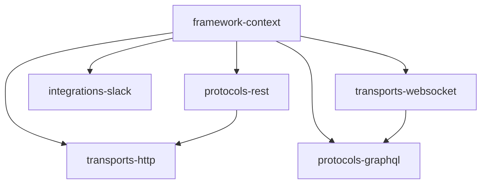

# 🐊 Croco Framework

**Move fast, build robustly.**  
Croco는 AWS Lambda와 API Gateway를 1급 시민(First-class Citizen)으로 지원하는 Node.js 기반의 **Opinionated(주견이 뚜렷한)** 프레임워크입니다.  
복잡한 비즈니스 로직을 다루는 엔터프라이즈 환경부터 빠른 배포가 필요한 스타트업까지, DDD(Domain-Driven Design) 패턴과 강력한 타입 안전성을 제공합니다.

---

## 🚀 왜 Croco인가요?

기존의 Node.js 프레임워크들은 유연하지만, 대규모 프로젝트에서 아키텍처의 일관성을 유지하기 어렵습니다. Croco는 다음과 같은 문제를 해결합니다:

- **아키텍처 부재**: 정형화된 4계층 구조를 통해 팀원 모두가 동일한 코드 패턴을 공유합니다.
- **서버리스 최적화**: 콜드 스타트를 최소화하고 AWS Lambda 환경에 최적화된 실행 어댑터를 제공합니다.
- **복잡한 도메인 로직**: 이벤트 주도 아키텍처(EDA)와 트랜잭션 관리(UoW)가 기본 내장되어 있습니다.
- **강력한 타입 안전성**: 코드 정의만으로 OpenAPI, GraphQL 스키마, gRPC 계약을 자동 생성합니다.

---

## 🏗 아키텍처

Croco는 관심사의 분리를 위해 **4계층 구조**를 따릅니다.



### 1. framework (기반 계층)
프레임워크의 뿌리가 되는 계층입니다.
- **framework-context**: 공통 Context 인터페이스, DI 컨테이너, 데코레이터 메타데이터 저장소를 포함합니다.

### 2. Protocols (정의 계층)
비즈니스 로직의 인터페이스를 정의합니다.
- **protocols-rest**: `@Controller`, `@Get` 등 REST API 정의를 위한 데코레이터를 제공합니다.
- **protocols-graphql**: **Yoga** 런타임을 활용한 Code-first GraphQL 정의를 지원합니다.
- **protocols-grpc**: (계획 중) gRPC 서비스 계약 정의를 지원합니다.

### 3. Transports (실행 계층)
정의된 프로토콜을 실제로 실행하는 어댑터입니다.
- **transports-http**: **Hono** 기반의 고성능 실행 엔진입니다. AWS Lambda (API Gateway v2) 핸들러 생성기를 내장하고 있습니다.
- **transports-websocket**: 실시간 양방향 통신을 위한 유틸리티를 제공합니다.

### 4. Integrations (통합 계층)
외부 시스템과의 연동을 추상화합니다.
- **integrations-slack**: **Slack Bolt**와 통합되어 Slack 앱 개발을 가속화합니다.

---

## 🛠 주요 기능

### 도메인 이벤트 (DDD)
Aggregate Root에서 이벤트를 발행하고, 타입 안전한 핸들러에서 이를 처리합니다.
```typescript
@RegisterEventHandler(OrderPlacedEvent)
class OrderPlacedHandler implements EventHandler<OrderPlacedEvent> {
  async handle(event: OrderPlacedEvent) {
    // 비즈니스 로직 처리
  }
}
```

### 트랜잭션 관리 (Unit of Work)
데코레이터 하나로 트랜잭션 경계를 설정하고, `AsyncLocalStorage`를 통해 컨텍스트를 전파합니다.
```typescript
@Service()
class OrderService {
  @Transactional()
  async placeOrder(dto: CreateOrderDto) {
    // 여러 리포지토리가 동일한 트랜잭션 내에서 동작합니다.
  }
}
```

### 문제 상세화 (Problem Details)
RFC 7807 표준을 따르는 일관된 에러 응답 형식을 제공합니다.
```typescript
throw Problem.notFound('user/not-found', '사용자를 찾을 수 없습니다.');
```

---

## ⚡️ Quick Start

### 1. REST API (Hono + AWS Lambda)
```typescript
@Controller('/users')
class UserController {
  @Get('/:id')
  async getUser(@Param('id') id: string) {
    return { id, name: 'Croco' };
  }
}

// lambda.ts
export const handler = createHttpHandler({
  controllers: [UserController]
});
```

### 2. GraphQL (Yoga + WebSocket)
```typescript
@ObjectType()
class User {
  @Field() id: string;
}

@Resolver(User)
class UserResolver {
  @Query(() => User)
  async me() { return { id: '1' }; }
}
```

### 3. Slack Integration (Bolt)
```typescript
@SlackAction('button_click')
class ActionHandler {
  async handle({ ack, body }) {
    await ack();
    // 처리 로직
  }
}
```

---

## 📦 패키지 현황

현재 Croco 프레임워크는 모노레포로 구성되어 있으며, 다음 패키지들이 구현되어 있습니다.

| 패키지 | 상태 | 설명 |
| :--- | :--- | :--- |
| `@croco/events-core` | ✅ 구현 | 도메인 이벤트 추상화 및 발행기 |
| `@croco/events-inmemory` | ✅ 구현 | 인메모리 이벤트 버스 구현체 |
| `@croco/tx-core` | ✅ 구현 | 트랜잭션 관리 코어 (`AsyncLocalStorage` 기반) |
| `@croco/tx-drizzle` | ✅ 구현 | Drizzle ORM용 트랜잭션 어댑터 |
| `@croco/problems-core` | ✅ 구현 | RFC 7807 표준 에러 처리 |
| `@croco/framework-context` | ✅ 구현 | 공통 Context 인터페이스, DI 컨테이너, 메타데이터 저장소 |
| `@croco/gid-core` | ✅ 구현 | Type-safe prefixed ID generation using ULID |
| `@croco/esbuild-plugin` | ✅ 구현 | esbuild 빌드 플러그인 |
| `@croco/utils-node` | ⚠️ Deprecated | Node.js 유틸리티 (더 이상 사용하지 않음) |
| `protocols-*` | 🚧 계획 | REST/GraphQL/gRPC 인터페이스 정의 |
| `transports-*` | 🚧 계획 | Hono 기반 Lambda 어댑터 및 WebSocket |
| `integrations-*` | 🚧 계획 | 외부 시스템 통합 (Slack 등) |

---

## 🔧 구현 상세 (`src/libs/`)

각 패키지의 핵심 구현 파일 구조입니다.

| 패키지 | 주요 파일 |
| :--- | :--- |
| `events-core` | `DomainEvent.ts`, `EventBus.ts`, `AggregateRoot.ts` |
| `events-inmemory` | `InMemoryEventBus.ts` |
| `tx-core` | `TransactionContext.ts`, `UnitOfWork.ts` |
| `tx-drizzle` | `DrizzleTransactionAdapter.ts` |
| `problems-core` | `Problem.ts`, `ProblemDetails.ts`, `ProblemCategory.ts` |
| `framework-context` | `Context.ts`, `Container.ts`, `MetadataStorage.ts` |
| `gid-core` | `GID.ts`, `PrefixRegistry.ts` |
| `esbuild-plugin` | `CrocoPlugin.ts` |

---

## 🛠 개발 환경

### 코드 품질 도구
- **Biome**: 린팅 및 포맷팅 (`quoteStyle: 'single'`, `lineWidth: 120`)
- **TypeScript**: 엄격 모드 + 데코레이터 지원
- **Vitest**: 테스트 프레임워크

### 주요 명령어
```bash
pnpm install          # 의존성 설치
pnpm build            # 모든 패키지 빌드
pnpm lint             # Biome 린트 검사
pnpm check            # Biome 전체 검사 (lint + format)
pnpm format           # Biome 포맷팅
pnpm test             # 테스트 실행
pnpm typecheck        # TypeScript 타입 검사
```

### Git Hooks (Lefthook)
- **Pre-commit**: Biome 자동 수정
- **Pre-push**: 테스트 및 타입 검사

---

## 🚢 배포 전략

Croco는 **AWS Lambda**를 최우선으로 고려합니다.
- **Fast Startup**: 불필요한 의존성을 배제하고 트리쉐이킹에 최적화된 빌드를 제공합니다.
- **API Gateway v2 Support**: 고성능 HTTP API를 위한 어댑터를 기본 제공합니다.
- **pnpm + Turbo**: 고성능 빌드 파이프라인을 통해 배포 속도를 극대화합니다.

```bash
pnpm run deploy -- --otp <otp>
```

---

## 📄 License
MIT License. Copyright (c) 2026 Croco Team.
