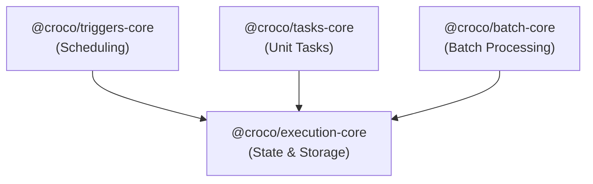

# Execution System Overview

Croco 프레임워크의 **Execution System**은 비동기 작업, 예약된 작업(Cron), 그리고 대용량 배치 처리를 통합적으로 관리하기 위한 시스템입니다.

## 아키텍처

시스템은 4개의 핵심 패키지로 구성되어 있습니다.



### 패키지별 역할

| 패키지 | 역할 | 주요 컴포넌트 |
| :--- | :--- | :--- |
| **execution-core** | 실행 상태 관리, 영속성, 공통 타입 | `ExecutionManager`, `ExecutionStore` |
| **triggers-core** | 작업 예약 및 트리거링 | `@Cron`, `@OnEvent` |
| **tasks-core** | 단일 작업 단위 정의 | `@Task` |
| **batch-core** | 대용량 데이터 처리 (ETL) | `Job`, `Step`, `ItemReader/Writer` |

## 통합 시나리오

### 1. 주기적인 배치 작업 실행

Cron 트리거를 사용하여 매일 밤 배치 작업을 실행하는 흐름입니다.

1. **Batch 정의**: `batch-core`를 사용하여 `Job` 구성
2. **Task 래핑**: `Job`을 실행하는 메서드를 `@Task`로 정의
3. **스케줄링**: 해당 메서드에 `@Cron`을 붙여 주기적 실행 예약

```typescript
@Component()
class SettlementBatch {
  
  @Cron('0 0 * * *') // 매일 자정
  @Task({ name: 'daily-settlement' })
  async run() {
    const job = new JobBuilder('settlement')
      .start(this.settlementStep)
      .build();
      
    // 배치 실행 로직 (BatchExecutor 등을 통해 실행)
  }
}
```

### 2. 비동기 작업 처리

API 요청으로 들어온 작업을 백그라운드에서 처리하는 흐름입니다.

1. **Task 정의**: 시간이 오래 걸리는 작업을 `@Task`로 정의
2. **API 핸들러**: `ExecutionManager`를 통해 Task 실행 요청 (ID 반환)
3. **Worker**: 대기열에서 Task를 꺼내 실행 및 상태 업데이트

```typescript
// Controller
@Post('/report')
async createReport() {
  const execution = await executionManager.create({ type: 'generate-report' });
  // 클라이언트에는 실행 ID만 즉시 반환 (202 Accepted)
  return { executionId: execution.id };
}

// Worker
@Task({ name: 'generate-report' })
async generateReport(payload: any) {
  // 리포트 생성...
}
```

## 확장성

### ExecutionStore 구현

기본 제공되는 인메모리 구현체 외에, 운영 환경에서는 영속성을 보장하는 저장소가 필요합니다.

- **DynamoDB**: 서버리스 환경에 적합, TTL 기능을 통한 자동 정리
- **Redis**: 빠른 상태 조회 및 락 관리
- **RDBMS**: 복잡한 쿼리나 조회가 필요한 경우

### 실행 환경

이 시스템은 특정 런타임에 종속되지 않습니다.
- **AWS Lambda**: EventBridge Scheduler -> Lambda (Cron), SQS -> Lambda (Task)
- **ECS / Kubernetes**: 장기 실행 프로세스 또는 배치 컨테이너
