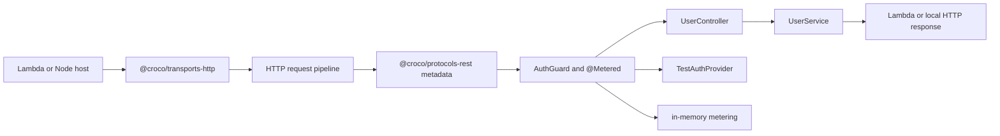

# Quick Start Lambda Example

Croco SaaS Backend Demo — Auth + Metering on AWS Lambda, wired with `@croco/auth-core`, `@croco/metering-core`, `@croco/protocols-rest`, and `@croco/transports-http`.

## Architecture Map

This example is intentionally small, but the files make each Croco boundary visible before you run
curl commands.

| Boundary     | Example role                                      | Files and packages                                                                              |
| ------------ | ------------------------------------------------- | ----------------------------------------------------------------------------------------------- |
| Framework    | Generated DI graph and application-owned lifetime | `@croco/esbuild-plugin`, `@croco/framework-module`, `src/app/bootstrap.ts`                      |
| Protocol     | REST controller metadata and parameter decorators | `@croco/protocols-rest`, `src/protocols/HealthController.ts`, `src/protocols/UserController.ts` |
| Transport    | HTTP route and middleware execution               | `@croco/transports-http`, `httpTransport()` and `createApp()` in `src/app/bootstrap.ts`         |
| Host         | Lambda invocation and local Node server lifecycle | `app.lambdaHandler()` in `src/index.ts`; `@croco/preset-node` in `src/app/bootstrap.ts`         |
| Build target | Entrypoint, output, and graph generation          | `scripts/build.ts`; not selected by `createApp()`                                               |
| Integrations | Replaceable auth and metering adapters            | `src/integrations/TestAuthProvider.ts`, `src/integrations/inMemoryMetering.ts`                  |
| App/domain   | Runtime-agnostic user behavior                    | `src/domain/UserService.ts`                                                                     |

Core lesson: controllers define protocol metadata, the HTTP transport executes it, hosts own
environment lifecycle, build targets describe artifacts, integrations are replaceable, and domain
services stay independent of Lambda, Hono, auth provider, or metering storage details.



Project shape:

```text
├── scripts/build.ts                     # Automatic DI generation and dev watch
└── src/
    ├── app/bootstrap.ts                 # Explicit logger boundary and HTTP transport
    ├── domain/UserService.ts            # App/domain behavior
    ├── integrations/ApiKeyGuard.ts      # Guard wired by the generated graph
    ├── integrations/TestAuthProvider.ts # Replaceable auth provider seam
    ├── integrations/inMemoryMetering.ts # Replaceable metering storage seam
    ├── protocols/HealthController.ts    # REST health protocol metadata
    ├── protocols/UserController.ts      # REST user protocol metadata
    └── index.ts                         # Lambda export and local dev start
```

`TestAuthProvider` can be replaced with Clerk, Auth0, or custom auth without changing
`UserController` or `UserService`. The in-memory metering setup can be replaced with provider-backed
storage without changing the controller or domain service. The build scans decorated application
components and generates the service and controller factories automatically for both `pnpm dev` and
`pnpm build`; no manual registration or code-generation command is needed. The bootstrap supplies
only the logger boundary to one `ApplicationRuntime`; the app-owned guard receives the scanned auth
provider through its generated factory. Metering is scoped to each HTTP request by middleware.
The Lambda handler enters the application scope for each invocation. Local Node requests run through a callback bound
to that scope by `ApplicationRuntime.bindHostCallback()`. The local host closes before the
application scope is disposed.

The HTTP bootstrap uses security headers, an explicit CORS origin, a 1 MB body limit, and an
in-memory sliding-window rate limiter. These middlewares satisfy Croco's default security
validation without cloud credentials. Disabling security validation is reserved for temporary
local migration or test fixtures, not the normal example path.

## Run Locally

```bash
pnpm install
pnpm dev
```

Then test the endpoints:

**Health check (no auth required):**

```bash
curl http://localhost:3000/api/health
```

Expected response:

```json
{ "status": "ok" }
```

**List users (requires auth header):**

```bash
curl -H "x-api-key: test-key" http://localhost:3000/api/users
```

Expected response: `200` with user list.

**Create user (requires auth header, triggers metering):**

```bash
curl -X POST -H "x-api-key: test-key" -H "Content-Type: application/json" \
  -d '{"name":"Alice","email":"alice@example.com"}' \
  http://localhost:3000/api/users
```

Expected response: `200` with created user. The `api_user_create` meter records the event.

> **Auth note**: Endpoints without `x-api-key: test-key` return `401`.

## Validate

From the repository root, run the isolated smoke:

```bash
pnpm quick-start-lambda:smoke
```

The smoke installs the example dependency closure, builds and typechecks the generated graph,
starts the same watch builder as `pnpm dev`, and verifies health, auth, list, and create endpoints
without cloud credentials.

## Deploy

Deploy the built `dist/index.js` and use its `handler` export as your AWS Lambda entry point. The
current example keeps the `app.lambdaHandler()` compatibility path; `@croco/preset-lambda` owns the canonical Lambda host
API for applications that separate this boundary.

## Prerequisites

- Node.js >=24 (run `nvm install 24 && nvm use 24` if your current version is unsupported, or `mise install` at the
  repository root; see [CONTRIBUTING.md](../../CONTRIBUTING.md#prerequisites))
- pnpm at the version pinned by the repository (`mise install` provides it)
