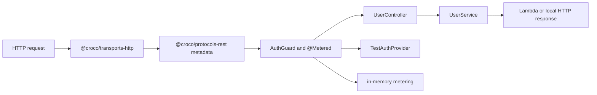

# Quick Start Lambda Example

Croco SaaS Backend Demo — Auth + Metering on AWS Lambda, wired with `@croco/auth-core`, `@croco/metering-core`, `@croco/protocols-rest`, and `@croco/transports-http`.

## Architecture Map

This example is intentionally small, but the files are arranged so each Croco layer is visible before you run curl commands.

| Layer        | Example role                                           | Files and packages                                                                                     |
| ------------ | ------------------------------------------------------ | ------------------------------------------------------------------------------------------------------ |
| Framework    | Dependency injection, component metadata, logger token | `@croco/framework-context`, `src/app/bootstrap.ts`, `src/domain/UserService.ts`                        |
| Protocols    | REST controller metadata and parameter decorators      | `@croco/protocols-rest`, `src/protocols/HealthController.ts`, `src/protocols/UserController.ts`        |
| Transports   | Runtime execution for local HTTP and AWS Lambda        | `@croco/transports-http`, `createApp()` in `src/app/bootstrap.ts`, `lambdaHandler()` in `src/index.ts` |
| Integrations | Replaceable auth and metering adapters                 | `src/integrations/TestAuthProvider.ts`, `src/integrations/inMemoryMetering.ts`                         |
| App/domain   | Runtime-agnostic user behavior                         | `src/domain/UserService.ts`                                                                            |

Core lesson: controllers define protocol metadata, transports execute it, integrations are replaceable, and domain services stay independent of Lambda, Hono, auth provider, or metering storage details.



Project shape:

```text
src/
├── app/bootstrap.ts                    # DI, integration registration, createApp
├── domain/UserService.ts               # App/domain behavior
├── integrations/TestAuthProvider.ts    # Replaceable auth provider seam
├── integrations/inMemoryMetering.ts    # Replaceable metering storage seam
├── protocols/HealthController.ts       # REST health protocol metadata
├── protocols/UserController.ts         # REST user protocol metadata
└── index.ts                            # Metadata import, app creation, Lambda export, local dev start
```

`TestAuthProvider` can be replaced with Clerk, Auth0, or custom auth without changing `UserController` or `UserService`. The in-memory metering setup can be replaced with provider-backed storage without changing the controller or domain service. `createApp().lambdaHandler()` is the transport boundary for Lambda; the protocol and domain code remain transport-neutral.

## Run Locally

```bash
pnpm install
pnpm dev
```

Then test the endpoints:

**Health check (no auth required):**

```bash
curl http://localhost:3000/api/health
```

Expected response:

```json
{ "status": "ok" }
```

**List users (requires auth header):**

```bash
curl -H "x-api-key: test-key" http://localhost:3000/api/users
```

Expected response: `200` with user list.

**Create user (requires auth header, triggers metering):**

```bash
curl -X POST -H "x-api-key: test-key" -H "Content-Type: application/json" \
  -d '{"name":"Alice","email":"alice@example.com"}' \
  http://localhost:3000/api/users
```

Expected response: `200` with created user. The `api_user_create` meter records the event.

> **Auth note**: Endpoints without `x-api-key: test-key` return `401`.

## Validate

From the repository root, run the same smoke command used by CI:

```bash
pnpm quick-start-lambda:smoke
```

The smoke installs the example dependency closure, typechecks the example, starts `pnpm dev`, and verifies
health, auth, list, and create endpoints without real cloud credentials.

## Deploy

Export the `handler` from `src/index.ts` as your AWS Lambda entry point.

## Prerequisites

- Node.js >= 18
- pnpm (install via `corepack enable && corepack prepare pnpm@latest --activate`)
