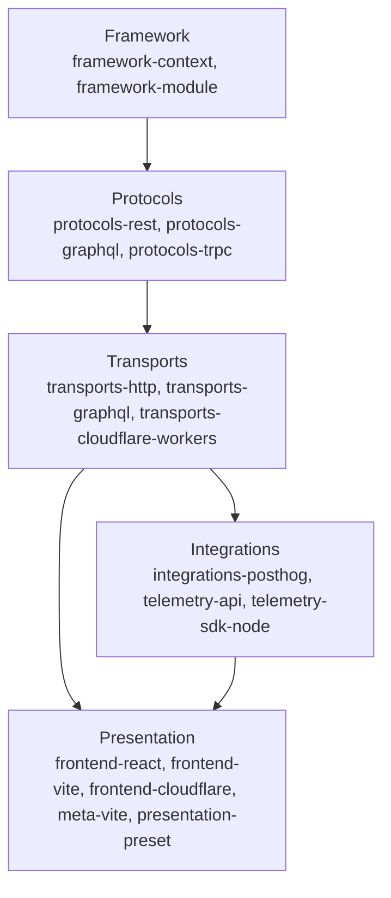

## Introduction

Croco uses an opinionated architecture to keep large codebases consistent and maintainable. The framework separates concerns into five current layers, then connects them with dependency injection and event-driven patterns.

This guide explains how each layer works, how the DI container wires components, and how domain events help you model complex business workflows.

## Five-Layer Architecture Diagram

Croco follows a five-layer architecture focused on separation of concerns:

## Layer Details

### 1. Framework Layer

The foundation of the ecosystem.

- **`framework-context`** provides shared context interfaces.
- **`framework-module`** supports module composition and package-level wiring.
- Includes the DI container and metadata storage used by decorators.
- Establishes the core contracts used by upper layers.

### 2. Protocols Layer

Defines application-facing interfaces and contracts.

- **`protocols-rest`** offers decorators like `@Controller` and `@Get`.
- **`protocols-graphql`** supports code-first GraphQL definitions on Yoga.
- **`protocols-trpc`** provides tRPC-oriented protocol contracts.
- **`openapi-spec`** and **`rpc-codegen`** turn protocol metadata into generated contracts and clients.

### 3. Transports Layer

Executes protocol definitions in runtime environments.

- **`transports-http`** runs REST definitions on a Hono-based engine.
- **`transports-graphql`** runs GraphQL schemas through the Croco transport surface.
- **`transports-cloudflare-workers`** adapts Croco applications to Cloudflare Workers.

### 4. Integrations Layer

Connects Croco to external systems.

- **`integrations-posthog`** integrates with PostHog-backed analytics and feature workflows.
- **`telemetry-api`** and **`telemetry-sdk-node`** provide OpenTelemetry-based tracing APIs and runtime setup.
- Keeps external platform wiring separate from domain logic.

### 5. Presentation Layer

Connects Croco backends to frontend and SSR application surfaces.

- **`frontend-react`** provides React integration helpers.
- **`frontend-vite`** provides Vite configuration helpers.
- **`frontend-cloudflare`** provides Cloudflare SSR handling.
- **`meta-vite`** provides the Meta Vite runtime for routing, server actions, and SSR/RSC streaming.
- **`presentation-preset`** composes backend and frontend presets for generated applications.

## DI Container

Croco's Dependency Injection (DI) container is defined in the framework layer and reused across the stack.

- Registers and resolves components from shared metadata.
- Supports common scopes such as singleton, request, and transient.
- Enables decoupling between protocol definitions and concrete runtime implementations.

By centralizing lifecycle management in the container, Croco keeps modules composable and testable.

## Event-Driven Architecture

Croco includes event-driven architecture (EDA) as a core pattern for complex domains.

- Domain events are emitted from aggregate roots.
- Handlers consume events in a type-safe way.
- Works naturally with Unit of Work boundaries and transactional flows.

This model helps teams separate command execution from side effects, reduce coupling, and evolve business logic safely over time.
