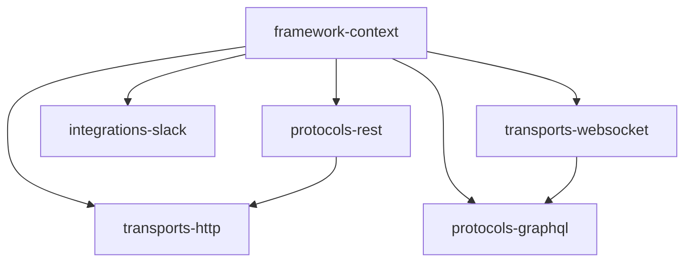

## Introduction

Croco uses an opinionated architecture to keep large codebases consistent and maintainable. The framework separates concerns into four clear layers, then connects them with dependency injection and event-driven patterns.

This guide explains how each layer works, how the DI container wires components, and how domain events help you model complex business workflows.

## 4-Layer Architecture Diagram

Croco follows a 4-layer architecture focused on separation of concerns:

## Layer Details

### 1. Framework Layer

The foundation of the ecosystem.

- **`framework-context`** provides shared context interfaces.
- Includes the DI container and metadata storage used by decorators.
- Establishes the core contracts used by upper layers.

### 2. Protocols Layer

Defines application-facing interfaces and contracts.

- **`protocols-rest`** offers decorators like `@Controller` and `@Get`.
- **`protocols-graphql`** supports code-first GraphQL definitions on Yoga.
- **`protocols-grpc`** is planned for future gRPC contract definitions.

### 3. Transports Layer

Executes protocol definitions in runtime environments.

- **`transports-http`** runs REST definitions on a Hono-based engine.
- Includes AWS Lambda (API Gateway v2) handler generation.
- **`transports-websocket`** provides utilities for real-time bidirectional communication.

### 4. Integrations Layer

Connects Croco to external systems.

- **`integrations-slack`** integrates with Slack Bolt to accelerate Slack app development.
- Keeps external platform wiring separate from domain logic.

## DI Container

Croco's Dependency Injection (DI) container is defined in the framework layer and reused across the stack.

- Registers and resolves components from shared metadata.
- Supports common scopes such as singleton, request, and transient.
- Enables decoupling between protocol definitions and concrete runtime implementations.

By centralizing lifecycle management in the container, Croco keeps modules composable and testable.

## Event-Driven Architecture

Croco includes event-driven architecture (EDA) as a core pattern for complex domains.

- Domain events are emitted from aggregate roots.
- Handlers consume events in a type-safe way.
- Works naturally with Unit of Work boundaries and transactional flows.

This model helps teams separate command execution from side effects, reduce coupling, and evolve business logic safely over time.
