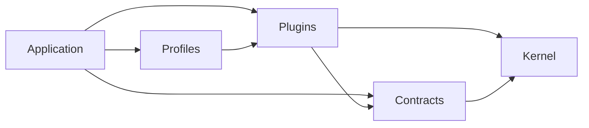
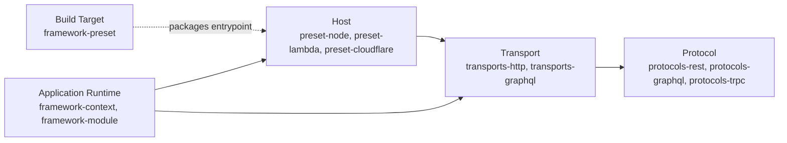

## Introduction

Croco is an integrated framework for product growth: low-level APIs, product and operator interfaces
with explicit policies, and contracts and evidence that coding agents can inspect. The architecture
assigns Croco responsibility for growth policy, measurement meaning and provenance, personalized SSR,
experiment decisions and exposure, cache boundaries, and performance policy. It reuses React/Vite RSC,
GraphQL/tRPC, TanStack/Apollo, external LLM SDKs, and database engines. The sections below distinguish
current implementations from integration targets.

This direction preserves decorators, SSR, and `meta-vite`. Simpler authoring should reduce repeated
wiring while keeping authorization, eligibility, price authority, actual exposure, conversion, and
completeness visible. GraphQL selection and partial errors, tRPC inference, REST input/status
semantics, private SSR isolation, and the native framework's cache ownership remain distinct contracts.
The shared business-operation authoring target in
[#2842](https://github.com/croco-dev/framework/issues/2842) connects decorated classes and function APIs
to the same operation, guard, and client contract; it does not require class users to maintain a
second schema, dependency list, or handler registry.

Desktop removal ([#2830](https://github.com/croco-dev/framework/issues/2830)) and replacement of the
generic LLM engine with narrow SDK boundaries
([#2832](https://github.com/croco-dev/framework/issues/2832)) are separate changes. LLM use, CLI/MCP,
review, usage budgets, and PII policy remain part of the direction. A universal DSL or a collection
of SDKs without integrated product behavior is outside this design.

Croco assigns each public package one canonical role in `docs/package-catalog.json` under
`packageRoles`: **Kernel**, **Contracts**, **Plugins**, **Application**, **Profiles**, or **Tooling**.
Subtype, domain, runtime support, maturity, certification, and spine membership are separate
metadata. The catalog's historical ecosystem groups remain a secondary inventory classification.

## Package Roles And Dependency Direction

| Role        | Responsibility                                                                                                           | Examples                                                                               |
| ----------- | ------------------------------------------------------------------------------------------------------------------------ | -------------------------------------------------------------------------------------- |
| Kernel      | Framework runtime primitives: DI, context, module composition, and lifecycle.                                            | `framework-context`, `framework-module`                                                |
| Contracts   | Provider/runtime-neutral domain and protocol contracts.                                                                  | `repository-core`, `protocols-rest`, `telemetry-api`                                   |
| Plugins     | Concrete implementations and bindings, with provider, protocol, transport, host, integration, and presentation subtypes. | `tx-drizzle`, `transports-http`, `preset-node`, `telemetry-sdk-node`, `frontend-react` |
| Application | App-owned modules and the composition root.                                                                              | Generated applications under `apps/*`                                                  |
| Profiles    | Tested, opinionated plugin/module compositions.                                                                          | `presentation-preset`                                                                  |
| Tooling     | Build, codegen, testing, and CLI surfaces.                                                                               | `framework-preset`, `rpc-codegen`, `openapi-spec`                                      |

Dependency arrows point from consumer to dependency; they do not describe a request pipeline.
Applications select profiles and plugins. Profiles compose plugins; plugins depend on contracts and
kernel primitives. Contracts may depend on kernel primitives, but neither Contracts nor Kernel
imports concrete Plugins. The architecture policy validates the permitted package edges against
the same canonical role metadata.

```mermaid
flowchart LR
  application[Application] --> profiles[Profiles]
  application --> plugins[Plugins]
  application --> contracts[Contracts]
  profiles --> plugins
  plugins --> contracts
  plugins --> kernel[Kernel]
  contracts --> kernel
```

`tx-drizzle` is a provider Plugin because it implements transaction and repository contracts with
Drizzle. `telemetry-api` is Contracts because applications consume its tracing API independently of
the Node SDK. `telemetry-sdk-node` is the concrete integration Plugin. Package names and secondary
catalog groups do not override these roles.

## Host, Transport, And Build Target

| Concept      | Owns                                                                                 | Does not own                                                    |
| ------------ | ------------------------------------------------------------------------------------ | --------------------------------------------------------------- |
| Host         | The environment lifecycle: Node process/server, Lambda invocation, or Workers fetch. | Protocol route execution or build output configuration.         |
| Transport    | A protocol/application surface such as HTTP, GraphQL, or RPC.                        | Deployment environment lifecycle or artifact packaging.         |
| Build Target | Entrypoint, output directory, module format, build hooks, and bundling constraints.  | Runtime invocation, request handling, or application lifecycle. |

A host may bind one or more transports. A build target may package a host entrypoint. Neither
relationship merges their responsibilities.

```mermaid
flowchart LR
  buildTarget[Build Target<br/>framework-preset] -. packages entrypoint .-> host
  host[Host<br/>preset-node, preset-lambda, preset-cloudflare]
  host --> transport[Transport<br/>transports-http, transports-graphql]
  transport --> protocol[Protocol<br/>protocols-rest, protocols-graphql, protocols-trpc]
  framework[Application Runtime<br/>framework-context, framework-module] --> host
  framework --> transport
```

The current `preset-*` packages are host-primary compatibility facades. Their canonical
`create*Host` APIs own runtime lifecycle, while `create*BuildTarget` APIs describe artifacts through
`@croco/framework-preset`. Deprecated preset and entry/handler aliases remain available for
compatibility; no package rename is required by this model.

## Responsibilities Within Roles

### Kernel

Kernel packages own framework runtime primitives and module composition.

- **`framework-context`** provides DI, request context, and runtime capability contracts.
- **`framework-module`** provides module composition, provider visibility, lifecycle hooks, and
  `ApplicationRuntime`.
- **`ApplicationRuntime.bindHostCallback()`** re-enters the owning application scope when a host
  invokes a retained callback and fences that callback after disposal.

### Contracts And Protocol Plugins

Protocol contracts describe application-facing surfaces without choosing a deployment host. Concrete
protocol library bindings are Plugins with the protocol subtype.

- **`protocols-rest`** offers decorators such as `@Controller` and `@Get`.
- **`protocols-graphql`** is a protocol Plugin for concrete GraphQL/Yoga bindings.
- **`protocols-trpc`** is a protocol Plugin for concrete tRPC bindings.
- **`openapi-spec`** and **`rpc-codegen`** are Tooling that turns protocol metadata into generated
  contracts and clients.

### Plugins: Transports

Transport packages execute protocol surfaces independently from the deployment host.

- **`transports-http`** executes REST routes through the Hono-backed HTTP engine.
- **`transports-graphql`** executes GraphQL schemas through the Croco transport surface.
- `CrocoApp.listen()` and `CrocoApp.lambdaHandler()` remain host convenience compatibility methods
  on `@croco/transports-http`; canonical composition binds the HTTP app to an explicit host.

`@croco/transports-cloudflare-workers` has a legacy transport-shaped name but owns the Workers fetch
lifecycle and runtime-context bridge. It remains a supported compatibility surface rather than being
renamed. New composition uses `@croco/preset-cloudflare`'s `createCloudflareWorkersHost()` API.

### Plugins: Hosts

Host packages own environment lifecycle and bind transport callbacks.

- **`preset-node`** owns Node server start and close through `createNodeHost()`.
- **`preset-lambda`** owns Lambda invocation conversion and flush boundaries through
  `createLambdaHost()`.
- **`preset-cloudflare`** owns Workers fetch, env, and `waitUntil` binding through
  `createCloudflareWorkersHost()`.

The same packages also export build-target factories as a compatibility facade, but build metadata
does not initialize or execute a host.

### Tooling: Build Targets

**`framework-preset`** is the canonical build-target contract. `defineCrocoBuildTarget()` describes
entrypoint, output format, output directory, and hooks. The deprecated `defineCrocoPreset()` name is
an alias for that build-time contract; it does not imply runtime composition.

`frontend-vite` and `meta-vite` also have the Tooling/build-target role. `frontend-vite` provides
Vite configuration helpers; `meta-vite` supplies Vite integration together with routing, server
actions, and SSR/RSC runtime helpers. Their frontend domain does not change their canonical role.

### Plugins: Integrations

Integration packages connect Croco to external systems.

- **`integrations-posthog`** integrates with PostHog-backed analytics and feature workflows.
- **`telemetry-sdk-node`** provides OpenTelemetry runtime setup; **`telemetry-api`** belongs to
  Contracts and supplies the application-facing tracing API.
- External platform wiring stays separate from domain logic and protocol execution.

### Plugins: Presentation

Presentation packages connect Croco backends to frontend and SSR application surfaces.

- **`frontend-react`** provides React integration helpers.
- **`frontend-cloudflare`** provides Cloudflare SSR handling.

### Profiles

**`presentation-preset`** composes backend and frontend build configuration for generated apps.
Its role is Profiles, separate from the presentation Plugin subtype.

## Generated Composition And DI

Application authors declare `@Component`, constructor dependencies, and `@Inject` tokens where needed.
The compiler scans selected server source roots, resolves dependencies, and emits factories plus an
inspectable graph in `.croco/di.generated.ts` and `.croco/di.manifest.json`. The server build connects
that graph to `createApplicationRuntime(...)`, which installs it in the application's own scope.
Adding an exported service under the default `src` scan root does not require another bootstrap
import or a repeated per-service `providers`/`deps` entry.

Scan boundaries, selected package descriptors/plugins, module imports/exports, ambiguous token
bindings, and overrides remain explicit. Build-time discovery does not execute application modules
or scan every installed package. Importing decorated files or the generated module does not register
process-global services. Functions and module/plugin factories remain useful for external SDKs,
secrets, and small standalone uses.

The current implementation uses generated factories rather than TypeDI or DI reflection. Unsupported
patterns, including provider inheritance, dynamic tokens, and interface dependencies without a token,
fail compilation. See the
[compile-time DI contract](https://github.com/croco-dev/framework/blob/trunk/docs/architecture/compile-time-di.md)
and [compiler configuration](https://github.com/croco-dev/framework/tree/trunk/packages/esbuild-plugin)
for supported syntax and migration details. Non-DI decorators can still need the
[reflection metadata library](https://github.com/rbuckton/reflect-metadata).

Croco's DI container is defined in the Kernel role and reused across the ecosystem. It
registers and resolves components, supports singleton, request, and transient scopes, and keeps
protocol definitions separate from concrete transports and hosts.

`ApplicationRuntime` owns one DI scope and module runtime. Create the application inside
`runtime.run()` and wrap retained host entry callbacks with `runtime.bindHostCallback()` so every
invocation uses that scope and cannot execute after disposal.

## Event-Driven Architecture

Croco includes event-driven architecture as a core pattern for complex domains.

- Domain events are emitted from aggregate roots.
- Handlers consume events through type-safe contracts.
- Unit of Work boundaries coordinate transactional delivery.

This model separates command execution from side effects without coupling event handlers to a host,
transport, or build target.

## Data Responsibilities

OLTP stays with Drizzle and the application's transactional model. Warehouse packages own analytical
facts, dimensions, loading, publication, and reads; ETL owns source decoding, projection, and batch
connections; metrics owns measurement meaning; storage owns original objects and files. These
responsibilities reuse the existing batch/execution, parser, reader, and store contracts. They do not
introduce a parallel growth-data layer, database, optimizer, ETL scheduler, or IaC system.

Transaction facts record business occurrences. [Customer Fact History](/en/guides/fact-history/)
records customer attribute values at effective and recorded times. The dimension target
([#2865](https://github.com/croco-dev/framework/issues/2865)) adds historical analytical joins; it does
not rename or duplicate either existing model. Pure calculations accept normalized inputs without a
DB. An integrated collection/storage profile must use the real ETL and warehouse dependencies; a mock
writer is evidence only for the behavior it exercises.

### One Capture From Declaration To Product Use

The following is a **conceptual integration example**, not a runnable end-to-end API. It reuses the
existing [`payment_captures` declaration](https://github.com/croco-dev/framework/tree/trunk/packages/warehouse-core#transaction-fact)
and identifies the adapter boundaries and unfinished integration work instead of copying its schema.

1. **Declare the order's confirmed payment capture.** The warehouse declaration states the grain
   (one server-confirmed capture within a tenant), identity key, column types, event time, and append
   policy. Identical payloads are replay; changed payloads for the same identity are conflicts.
   Trusted application/environment/tenant scope and model generation qualify the grain. Source record,
   attempt, batch, and snapshot IDs are separate identities. External IDs need provider/account
   namespaces. Money preserves exact minor units and currency; event time is separate from ingestion
   time. The compiler validates the declaration, not the truth of the business event. OLTP orders are
   not automatically copied into facts.
2. **Decode and project through shared ETL.** Use the existing
   [`etl-core/source` decoder](https://github.com/croco-dev/framework/tree/trunk/packages/etl-core)
   for supported CSV/JSONL input and validate product meaning before writing normalized rows. The
   source/projection/fact pipeline in [#2857](https://github.com/croco-dev/framework/issues/2857) is
   target integration with existing batch execution. The declaration-to-physical-binding manifest in
   [#2859](https://github.com/croco-dev/framework/issues/2859) is also target work. A logical model or
   snapshot is not necessarily a physical table, and each consumer must not create its own parser.
3. **Record receipt, completion, validation, then publication.** Acceptance of work does not prove
   durable storage; a durable receipt does not prove execution completion; completion does not prove
   valid, complete data. The current
   [PostgreSQL provider](https://github.com/croco-dev/framework/tree/trunk/packages/warehouse-postgres#fact-warehouse)
   writes unpublished candidates, reconciles indeterminate commit receipts, seals validated data,
   and publishes with head/revision and fence checks. Readers pin a snapshot across pages. The
   [Warehouse Explorer example](https://github.com/croco-dev/framework/tree/trunk/examples/warehouse%2Dexplorer)
   demonstrates that provider boundary, not the entire integration chain.
4. **Define the metric.** Metrics owns the capture population, time window, unit, currency grouping,
   filter, and any numerator/denominator. Reuse `defineMetric` and `compileMetric`; an application
   adapter must supply the fact-column contract expected by metrics until shared binding is provided.
   Moving the PostgreSQL metrics store into `warehouse-postgres/metrics` preserves storage behavior;
   it does not certify the measurement or convert legacy metrics tables into declared facts.
5. **Read through the common authorized service.** The current `MetricReadService` and registered
   query executor use trusted authorization, budgets, source revisions, snapshot references, and
   reviewed-report matching. The [metric-read example](https://github.com/croco-dev/framework/tree/trunk/examples/metric-read)
   demonstrates verified and partial outcomes in memory. The executor still supplies its provider
   read; this service does not itself implement PostgreSQL snapshot pinning. The broader
   [#2862](https://github.com/croco-dev/framework/issues/2862) integration, CLI/MCP surfaces
   ([#2852](https://github.com/croco-dev/framework/issues/2852)), and optional natural-language UI
   ([#2828](https://github.com/croco-dev/framework/issues/2828)) must reuse this catalog, runner, and
   quality contract. Read APIs and CLI work do not wait for an LLM account or natural-language UI.
6. **Publish complete audience membership for product execution.** An application adapter supplies
   the normalized cohort inputs and publishes a completed result through the existing
   [cohort contracts](https://github.com/croco-dev/framework/tree/trunk/packages/cohort-core).
   `PublishedCohortReader` and `CohortAudienceSource` consume an immutable publication. Analysis and
   membership generation happen asynchronously; the product request reads that execution snapshot.
   Warehouse queries, Google Search Console, and LLM calls are not default synchronous dependencies
   of the product detail page, experiment, or campaign. The integrated product example
   ([#2855](https://github.com/croco-dev/framework/issues/2855)) and experiment/SSR wiring
   ([#2821](https://github.com/croco-dev/framework/issues/2821),
   [#2838](https://github.com/croco-dev/framework/issues/2838)) remain target work.

### Change, Quality, And Provider Boundaries

Git holds declarations and reviewed migrations or, in the planned warehouse tooling, plan hashes.
Runtime systems hold source snapshots, execution state, publications, and secrets. The target
[plan/inspect workflow](https://github.com/croco-dev/framework/issues/2860) is read-only;
[apply](https://github.com/croco-dev/framework/issues/2861) consumes the reviewed plan using each
provider's native reconciliation and recovery semantics without recompiling it. There is one migration
owner per physical object, no DDL at application boot, and no implied distributed transaction across
providers. The existing [migration runner](https://github.com/croco-dev/framework/tree/trunk/packages/migration-runner)
provides PostgreSQL migration/checkpoint execution; this is narrower than the warehouse plan target.
The [backfill target](https://github.com/croco-dev/framework/issues/2863) fixes code version and source
cutoff, validates the candidate, and only then switches the published snapshot.

Keep quality dimensions separate: exactness describes calculation precision; freshness describes
age; temporal completeness describes time-window coverage; population coverage describes included
subjects; validity describes contract checks; reproducibility describes whether inputs and definitions
can be reproduced. An exact sum can still omit late captures. A successful request, recent maximum
event time, or completed job proves none of the other dimensions by itself.

The current PostgreSQL provider supplies durable receipts and validated publication. The ClickHouse
publication target ([#2864](https://github.com/croco-dev/framework/issues/2864)), external read-only
warehouse target ([#2847](https://github.com/croco-dev/framework/issues/2847)), file/archive replay
([#2870](https://github.com/croco-dev/framework/issues/2870)), and local file-snapshot query target
([#2871](https://github.com/croco-dev/framework/issues/2871)) have different storage and recovery
boundaries. Read access does not imply write ownership; a file or local query does not imply a durable
warehouse publication. Their guarantees require provider-specific evidence. Package existence or a
passing PR test report alone is not certification or a production-readiness claim.

Deletion takes precedence over historical reproducibility: replay, backfill, retained snapshots, and
caches must not resurrect suppressed subjects. PostgreSQL currently supplies suppression tombstones
and privacy epochs; the cross-provider deletion/retention propagation in
[#2869](https://github.com/croco-dev/framework/issues/2869) remains target work.

### Execution Snapshot Rules

Reuse the existing audience/assignment contracts for `scope`, `definitionVersion`,
`sourceSnapshotRefs`, `generatedAt`, `validUntil`, `schemaVersion`, `contentHash`, and `privacyVersion`.
A new generic serving platform is not required. A valid completed cohort snapshot can remain readable
through an upstream outage. Expired, withdrawn, mismatched, or stale-privacy publications are explicitly
unavailable; there is no implicit stale grace period. Any product fallback must be explicit.
Rollback to an older snapshot must still pass schema, validity, current authorization, and current
privacy checks. Current suppression applies even when the historical membership included the subject.

Membership and stale analytical values never override current price, purchase eligibility, balance,
or access decisions in the owning transactional domain. A fallback is not a normal control assignment
or actual exposure. Record exposure only when the relevant surface is shown, and use the metric's
specified population and conversion denominator; sampled traces are not that denominator.

## Implementation And Release Status

Status checked on **2026-10-02** against repository source and GitHub. Open issues can contain partially
implemented surfaces; closed issues and merged PRs do not establish an npm release.

- Generated DI is present; [#2891](https://github.com/croco-dev/framework/pull/2891) merged for
  [#2831](https://github.com/croco-dev/framework/issues/2831). Fact declarations
  ([#2856](https://github.com/croco-dev/framework/issues/2856)), PostgreSQL fact publication
  ([#2845](https://github.com/croco-dev/framework/issues/2845)), and cohort publication
  ([#2802](https://github.com/croco-dev/framework/issues/2802)) are closed and have current source.
- [#2875](https://github.com/croco-dev/framework/pull/2875), the PostgreSQL metrics provider move,
  merged on 2026-09-22. Earlier notes calling it unmerged are historical. Release availability needs
  separate version/release evidence; this guide makes no release claim.
- The remaining ETL, warehouse tooling, migration planning, backfill, provider expansion, deletion
  propagation, and product integration targets described above remain open as of this check.
  Current source includes the decoder and `MetricReadService`, but does not prove the entire
  declared ETL-to-product chain is connected.
  The warehouse compiler explicitly excludes periodic/accumulating fact kinds and correction policies;
  provider DDL and durable storage are outside its root declaration API.

The [package catalog](https://github.com/croco-dev/framework/blob/trunk/docs/package-catalog.json)
and [architecture policy](https://github.com/croco-dev/framework/blob/trunk/docs/architecture-policy.md)
remain the package-boundary sources of truth. Use the linked executable examples and package contracts
for supported APIs rather than treating this conceptual integration as an implementation recipe.
