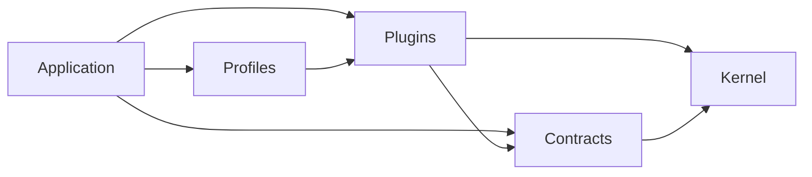
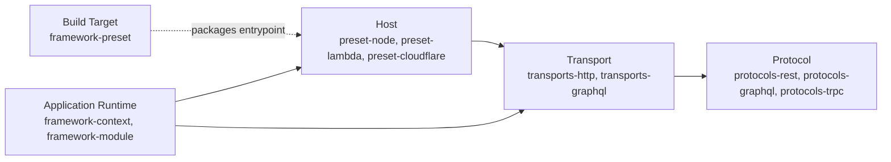

## 소개

Croco는 제품 성장을 위한 통합 프레임워크입니다. 저수준 API, 명시적 정책을 갖춘
제품·운영자 인터페이스, 코딩 에이전트가 살펴볼 수 있는 계약과 근거를 제공합니다.
아키텍처는 성장 정책, 측정 의미와 출처, 개인화 SSR, 실험 결정과 노출, 캐시 경계,
성능 정책에 대한 책임을 Croco에 둡니다. React/Vite RSC, GraphQL/tRPC,
TanStack/Apollo, 외부 LLM SDK, 데이터베이스 엔진은 재사용합니다. 아래 섹션은 현재
구현과 통합 목표를 구분합니다.

이 방향성은 데코레이터, SSR, `meta-vite`를 유지합니다. 더 간단한 작성 방식은 인가,
자격, 가격 권한, 실제 노출, 전환, 완전성을 계속 보이게 하면서 반복 배선을 줄여야
합니다. GraphQL 셀렉션과 부분 오류, tRPC 추론, REST 입력/상태 의미, 비공개 SSR
격리, 네이티브 프레임워크의 캐시 소유권은 서로 다른 계약으로 남습니다.
[#2842](https://github.com/croco-dev/framework/issues/2842)의 공유 비즈니스 오퍼레이션
작성 목표는 데코레이터 클래스와 함수 API를 같은 오퍼레이션·가드·클라이언트 계약에
연결합니다. 클래스 사용자에게 두 번째 스키마, 의존성 목록, 핸들러 레지스트리
유지를 요구하지 않습니다.

데스크톱 제거([#2830](https://github.com/croco-dev/framework/issues/2830))와 범용
LLM 엔진을 좁은 SDK 경계로 교체하는 작업
([#2832](https://github.com/croco-dev/framework/issues/2832))은 별도의 변경입니다.
LLM 사용, CLI/MCP, 리뷰, 사용량 예산, PII 정책은 방향성에 그대로 포함됩니다.
범용 DSL이나 통합 제품 동작 없는 SDK 모음은 이 설계의 범위를 벗어납니다.

Croco는 각 공개 패키지에 `docs/package-catalog.json`의 `packageRoles` 아래에서 하나의
표준 역할을 부여합니다. **Kernel**, **Contracts**, **Plugins**,
**Application**, **Profiles**, **Tooling** 중 하나입니다. 하위 타입, 도메인,
런타임 지원, 성숙도, 인증, spine 소속은 별도 메타데이터입니다. 카탈로그의 기존
생태계 그룹은 보조 인벤토리 분류로 남습니다.

## 패키지 역할과 의존성 방향

| 역할        | 책임                                                                                                | 예시                                                                                   |
| ----------- | --------------------------------------------------------------------------------------------------- | -------------------------------------------------------------------------------------- |
| Kernel      | 프레임워크 런타임 원시 요소: DI, 컨텍스트, 모듈 컴포지션, 수명주기.                                 | `framework-context`, `framework-module`                                                |
| Contracts   | 제공자/런타임 중립적인 도메인과 프로토콜 계약.                                                      | `repository-core`, `protocols-rest`, `telemetry-api`                                   |
| Plugins     | provider, protocol, transport, host, integration, presentation 하위 타입을 가진 구체 구현과 바인딩. | `tx-drizzle`, `transports-http`, `preset-node`, `telemetry-sdk-node`, `frontend-react` |
| Application | 앱 소유 모듈과 컴포지션 루트.                                                                       | `apps/*` 아래의 생성 애플리케이션                                                      |
| Profiles    | 검증된 의견 포함 플러그인/모듈 컴포지션.                                                            | `presentation-preset`                                                                  |
| Tooling     | 빌드, 코드젠, 테스팅, CLI 표면.                                                                     | `framework-preset`, `rpc-codegen`, `openapi-spec`                                      |

의존성 화살표는 소비자에서 의존 대상으로 향합니다. 요청 파이프라인을 설명하지
않습니다. 애플리케이션은 프로필과 플러그인을 선택합니다. 프로필은 플러그인을
조합하고, 플러그인은 계약과 커널 원시 요소에 의존합니다. 계약과 커널은 구체
플러그인을 import하지 않습니다. 아키텍처 정책은 같은 표준 역할 메타데이터를
기준으로 허용된 패키지 간선을 검증합니다.

`tx-drizzle`은 Drizzle로 트랜잭션과 리포지토리 계약을 구현하므로 provider
플러그인입니다. `telemetry-api`는 애플리케이션이 Node SDK와 독립적으로 트레이싱
API를 소비하므로 계약입니다. `telemetry-sdk-node`는 구체 통합 플러그인입니다.
패키지 이름과 보조 카탈로그 그룹은 이 역할을 바꾸지 않습니다.

## Host, Transport, Build Target

| 개념         | 소유                                                           | 소유하지 않음                                  |
| ------------ | -------------------------------------------------------------- | ---------------------------------------------- |
| Host         | 환경 수명주기: Node 프로세스/서버, Lambda 호출, Workers fetch. | 프로토콜 라우트 실행이나 빌드 산출물 설정.     |
| Transport    | HTTP, GraphQL, RPC 같은 프로토콜/애플리케이션 표면.            | 배포 환경 수명주기나 아티팩트 패키징.          |
| Build Target | 진입점, 출력 디렉터리, 모듈 형식, 빌드 훅, 번들링 제약.        | 런타임 호출, 요청 처리, 애플리케이션 수명주기. |

하나의 host가 여러 transport를 바인딩할 수 있습니다. build target은 host 진입점을
패키징할 수 있습니다. 어느 관계도 서로의 책임을 합치지 않습니다.

현재 `preset-*` 패키지는 host 우선 호환 파사드입니다. 표준 `create*Host` API가
런타임 수명주기를 소유하고, `create*BuildTarget` API는 `@croco/framework-preset`을
통해 아티팩트를 기술합니다. 폐기 예정인 preset과 entry/handler 별칭은 호환용으로
유지됩니다. 패키지 이름 변경은 필요하지 않습니다.

## 역할 안의 책임

### Kernel

Kernel 패키지는 프레임워크 런타임 원시 요소와 모듈 컴포지션을 소유합니다.

- **`framework-context`**는 DI, 요청 컨텍스트, 런타임 capability 계약을 제공합니다.
- **`framework-module`**은 모듈 컴포지션, provider 가시성, 수명주기 훅,
  `ApplicationRuntime`을 제공합니다.
- **`ApplicationRuntime.bindHostCallback()`**은 host가 유지된 콜백을 호출할 때
  소유 애플리케이션 스코프로 다시 들어가고, 폐기 후에는 해당 콜백을 차단합니다.

### 계약과 프로토콜 플러그인

프로토콜 계약은 배포 host를 선택하지 않고 애플리케이션 표면을 기술합니다. 구체
프로토콜 라이브러리 바인딩은 protocol 하위 타입의 플러그인입니다.

- **`protocols-rest`**는 `@Controller`, `@Get` 같은 데코레이터를 제공합니다.
- **`protocols-graphql`**은 구체 GraphQL/Yoga 바인딩용 프로토콜 플러그인입니다.
- **`protocols-trpc`**는 구체 tRPC 바인딩용 프로토콜 플러그인입니다.
- **`openapi-spec`**과 **`rpc-codegen`**은 프로토콜 메타데이터를 생성 계약과
  클라이언트로 바꾸는 Tooling입니다.

### 플러그인: Transport

Transport 패키지는 배포 host와 독립적으로 프로토콜 표면을 실행합니다.

- **`transports-http`**는 Hono 기반 HTTP 엔진으로 REST 라우트를 실행합니다.
- **`transports-graphql`**은 Croco transport 표면으로 GraphQL 스키마를 실행합니다.
- `CrocoApp.listen()`과 `CrocoApp.lambdaHandler()`는
  `@croco/transports-http`의 host 편의 호환 메서드로 남습니다. 표준 컴포지션은
  HTTP 앱을 명시적 host에 바인딩합니다.

`@croco/transports-cloudflare-workers`는 이름이 transport 형태지만 Workers fetch
수명주기와 런타임 컨텍스트 브리지를 소유합니다. 이름을 바꾸지 않고 지원되는
호환 표면으로 남습니다. 새 컴포지션은 `@croco/preset-cloudflare`의
`createCloudflareWorkersHost()` API를 사용합니다.

### 플러그인: Host

Host 패키지는 환경 수명주기를 소유하고 transport 콜백을 바인딩합니다.

- **`preset-node`**는 `createNodeHost()`로 Node 서버 시작과 종료를 소유합니다.
- **`preset-lambda`**는 `createLambdaHost()`로 Lambda 호출 변환과 flush 경계를
  소유합니다.
- **`preset-cloudflare`**는 `createCloudflareWorkersHost()`로 Workers fetch,
  env, `waitUntil` 바인딩을 소유합니다.

같은 패키지가 호환 파사드로 build-target 팩토리도 export하지만, 빌드 메타데이터는
host를 초기화하거나 실행하지 않습니다.

### Tooling: Build Target

**`framework-preset`**은 표준 build-target 계약입니다.
`defineCrocoBuildTarget()`은 진입점, 출력 형식, 출력 디렉터리, 훅을 기술합니다.
폐기 예정인 `defineCrocoPreset()` 이름은 해당 빌드타임 계약의 별칭입니다.
런타임 컴포지션을 뜻하지 않습니다.

`frontend-vite`와 `meta-vite`도 Tooling/build-target 역할입니다.
`frontend-vite`는 Vite 설정 헬퍼를 제공하고, `meta-vite`는 라우팅, 서버 액션,
SSR/RSC 런타임 헬퍼와 함께 Vite 통합을 제공합니다. 프론트엔드 도메인이 표준
역할을 바꾸지는 않습니다.

### 플러그인: Integrations

통합 패키지는 Croco를 외부 시스템에 연결합니다.

- **`integrations-posthog`**는 PostHog 기반 분석·기능 워크플로우와 통합합니다.
- **`telemetry-sdk-node`**는 OpenTelemetry 런타임 설정을 제공하고,
  **`telemetry-api`**는 계약에 속해 애플리케이션용 트레이싱 API를 제공합니다.
- 외부 플랫폼 배선은 도메인 로직 및 프로토콜 실행과 분리된 채로 유지됩니다.

### 플러그인: Presentation

프레젠테이션 패키지는 Croco 백엔드를 프론트엔드·SSR 애플리케이션 표면에
연결합니다.

- **`frontend-react`**는 React 통합 헬퍼를 제공합니다.
- **`frontend-cloudflare`**는 Cloudflare SSR 처리를 제공합니다.

### Profiles

**`presentation-preset`**은 생성 앱용 백엔드·프론트엔드 빌드 설정을 조합합니다.
역할은 Profiles이며 presentation 플러그인 하위 타입과 다릅니다.

## 생성형 컴포지션과 DI

애플리케이션 작성자는 `@Component`, 생성자 의존성, 필요한 곳의 `@Inject` 토큰을
선언합니다. 컴파일러가 선택된 서버 소스 루트를 스캔하고 의존성을 해결한 뒤
`.croco/di.generated.ts`와 `.croco/di.manifest.json`에 팩토리와 살펴볼 수 있는
그래프를 생성합니다. 서버 빌드는 해당 그래프를 `createApplicationRuntime(...)`에
연결하고, 이는 애플리케이션 고유 스코프에 설치합니다. 기본 `src` 스캔 루트 아래에
export된 서비스를 추가해도 별도 부트스트랩 import나 서비스별
`providers`/`deps` 항목 반복이 필요하지 않습니다.

스캔 경계, 선택된 패키지 descriptor/플러그인, 모듈 import/export, 모호한 토큰
바인딩, 오버라이드는 명시적으로 유지됩니다. 빌드타임 탐색은 애플리케이션 모듈을
실행하거나 설치된 모든 패키지를 스캔하지 않습니다. 데코레이터 파일을 import하거
생성 모듈을 import해도 프로세스 전역 서비스가 등록되지 않습니다. 함수와
모듈/플러그인 팩토리는 외부 SDK, 시크릿, 작은 독립 사용에 여전히 유용합니다.

현재 구현은 TypeDI나 DI 리플렉션 대신 생성 팩토리를 사용합니다. provider 상속,
동적 토큰, 토큰 없는 인터페이스 의존성 같은 미지원 패턴은 컴파일 실패합니다.
지원 문법과 마이그레이션 상세는
[컴파일타임 DI 계약](https://github.com/croco-dev/framework/blob/trunk/docs/architecture/compile-time-di.md)과
[컴파일러 설정](https://github.com/croco-dev/framework/tree/trunk/packages/esbuild-plugin)을
보세요. 비 DI 데코레이터에는 여전히
[리플렉션 메타데이터 라이브러리](https://github.com/rbuckton/reflect-metadata)가
필요할 수 있습니다.

Croco의 DI 컨테이너는 Kernel 역할에 정의되어 생태계 전체에서 재사용됩니다.
컴포넌트를 등록·해결하고 singleton, request, transient 스코프를 지원하며,
프로토콜 정의와 구체 transport·host를 분리합니다.

`ApplicationRuntime`은 하나의 DI 스코프와 모듈 런타임을 소유합니다.
애플리케이션을 `runtime.run()` 안에서 만들고, 유지된 host 진입 콜백은
`runtime.bindHostCallback()`으로 감싸서 모든 호출이 해당 스코프를 사용하고 폐기
후에는 실행될 수 없게 합니다.

## 이벤트 기반 아키텍처

Croco는 복잡한 도메인의 핵심 패턴으로 이벤트 기반 아키텍처를 포함합니다.

- 도메인 이벤트는 애그리거트 루트에서 방출됩니다.
- 핸들러는 타입 안전한 계약으로 이벤트를 소비합니다.
- Unit of Work 경계가 트랜잭션 전달을 조율합니다.

이 모델은 명령 실행과 부수 효과를 분리하면서 이벤트 핸들러를 host, transport,
build target에 결합하지 않습니다.

## 데이터 책임

OLTP는 Drizzle과 애플리케이션의 트랜잭션 모델에 둡니다. Warehouse 패키지는 분석
fact, dimension, 적재, 게시, 조회를 소유합니다. ETL은 소스 디코딩, 프로젝션,
배치 연결을 소유합니다. metrics는 측정 의미를 소유하고, storage는 원본 객체와
파일을 소유합니다. 이 책임들은 기존 배치/실행, 파서, 리더, 저장소 계약을
재사용합니다. 별도의 성장 데이터 계층, 데이터베이스, 옵티마이저, ETL 스케줄러,
IaC 시스템을 도입하지 않습니다.

트랜잭션 fact는 비즈니스 발생을 기록합니다.
[Customer Fact History](/en/guides/fact-history/)는 유효 시점과 기록 시점의 고객
속성값을 기록합니다. dimension 목표
([#2865](https://github.com/croco-dev/framework/issues/2865))는 과거 분석 조인을
추가합니다. 기존 모델을 이름을 바꾸거나 복제하지 않습니다. 순수 계산은 DB 없이
정규화된 입력을 받습니다. 통합 수집/저장소 프로필은 실제 ETL과 warehouse
의존성을 사용해야 합니다. 목 writer는 그 동작을 실행한 근거일 뿐입니다.

### 선언에서 제품 사용까지 한 번의 캡처

다음은 **개념적 통합 예시**이며 실행 가능한 종단 간 API가 아닙니다. 기존
[`payment_captures` 선언](https://github.com/croco-dev/framework/tree/trunk/packages/warehouse-core#transaction-fact)을
재사용하고, 스키마를 복사하는 대신 어댑터 경계와 미완성 통합 작업을 식별합니다.

1. **주문의 확정 결제 캡처를 선언합니다.** warehouse 선언은 grain(tenant 안의
   서버 확정 캡처 1건), 식별 키, 컬럼 타입, 이벤트 시각, append 정책을 명시합니다.
   동일한 페이로드는 리플레이이며, 같은 식별자의 변경된 페이로드는 충돌입니다.
   신뢰된 애플리케이션/환경/tenant 스코프와 모델 생성이 grain을 한정합니다.
   소스 레코드, 시도, 배치, 스냅샷 ID는 별도 식별자입니다. 외부 ID에는
   provider/계정 네임스페이스가 필요합니다. 금액은 정확한 최소 단위와 통화를
   유지하고, 이벤트 시각은 수집 시각과 분리됩니다. 컴파일러는 선언을 검증하며,
   비즈니스 이벤트의 진위를 검증하지는 않습니다. OLTP 주문이 자동으로 fact에
   복사되지 않습니다.
2. **공유 ETL로 디코드하고 프로젝션합니다.** 지원되는 CSV/JSONL 입력에는 기존
   [`etl-core/source` 디코더](https://github.com/croco-dev/framework/tree/trunk/packages/etl-core)를
   사용하고, 정규 행을 쓰기 전에 제품 의미를 검증합니다. [#2857](https://github.com/croco-dev/framework/issues/2857)의
   source/projection/fact 파이프라인은 기존 배치 실행과의 목표 통합입니다.
   [#2859](https://github.com/croco-dev/framework/issues/2859)의 선언-물리 바인딩
   매니페스트도 목표 작업입니다. 논리 모델이나 스냅샷이 반드시 물리 테이블인
   것은 아니며, 각 소비자가 자체 파서를 만들면 안 됩니다.
3. **접수, 완료, 검증, 게시를 순서대로 기록합니다.** 작업 수락이 내구 저장을
   증명하지 않습니다. 내구 영수증이 실행 완료를 증명하지 않습니다. 완료가 유효한
   완전 데이터를 증명하지 않습니다. 현재
   [PostgreSQL 제공자](https://github.com/croco-dev/framework/tree/trunk/packages/warehouse-postgres#fact-warehouse)는
   미게시 후보를 쓰고, 불확정 커밋 영수증을 조정하고, 검증된 데이터를 seal한 뒤,
   head/revision과 fence 검사와 함께 게시합니다. 리더는 페이지에 걸쳐 스냅샷을
   pin합니다.
   [Warehouse Explorer 예제](https://github.com/croco-dev/framework/tree/trunk/examples/warehouse%2Dexplorer)는
   전체 통합 체인이 아니라 해당 제공자 경계를 보여줍니다.
4. **지표를 정의합니다.** metrics는 캡처 모집단, 시간 창, 단위, 통화 그룹화,
   필터, 분자/분모를 소유합니다. `defineMetric`과 `compileMetric`을 재사용하고,
   공유 바인딩이 제공될 때까지 애플리케이션 어댑터가 metrics가 기대하는
   fact-컬럼 계약을 공급해야 합니다. PostgreSQL metrics 저장소를
   `warehouse-postgres/metrics`로 옮기는 것은 저장 동작을 유지합니다. 측정을
   인증하거나 레거시 metrics 테이블을 선언 fact로 바꾸지는 않습니다.
5. **공통 인가 서비스를 통해 읽습니다.** 현재 `MetricReadService`와 등록된 쿼리
   실행자는 신뢰된 인가, 예산, 소스 리비전, 스냅샷 참조, 검토된 리포트 매칭을
   사용합니다. [metric-read 예제](https://github.com/croco-dev/framework/tree/trunk/examples/metric-read)는
   검증 결과와 부분 결과를 인메모리로 보여줍니다. 실행자는 여전히 제공자 읽기를
   공급합니다. 이 서비스 자체가 PostgreSQL 스냅샷 pin을 구현하지는 않습니다.
   더 넓은 [#2862](https://github.com/croco-dev/framework/issues/2862) 통합,
   CLI/MCP 표면([#2852](https://github.com/croco-dev/framework/issues/2852)),
   선택적 자연어 UI([#2828](https://github.com/croco-dev/framework/issues/2828))는
   이 카탈로그, 러너, 품질 계약을 재사용해야 합니다. 읽기 API와 CLI 작업은 LLM
   계정이나 자연어 UI를 기다리지 않습니다.
6. **제품 실행용으로 완성된 오디언스 소속을 게시합니다.** 애플리케이션 어댑터가
   정규화된 코호트 입력을 공급하고 기존
   [cohort 계약](https://github.com/croco-dev/framework/tree/trunk/packages/cohort-core)을
   통해 완성 결과를 게시합니다. `PublishedCohortReader`와
   `CohortAudienceSource`는 불변 게시물을 소비합니다. 분석과 소속 생성은
   비동기로 일어나고, 제품 요청은 해당 실행 스냅샷을 읽습니다. warehouse 쿼리,
   Google Search Console, LLM 호출은 제품 상세 페이지, 실험, 캠페인의 기본 동기
   의존성이 아닙니다. 통합 제품 예제
   ([#2855](https://github.com/croco-dev/framework/issues/2855))와 실험/SSR
   배선([#2821](https://github.com/croco-dev/framework/issues/2821),
   [#2838](https://github.com/croco-dev/framework/issues/2838))은 목표 작업으로
   남습니다.

### 변경, 품질, 제공자 경계

Git은 선언과 검토된 migration을, 계획된 warehouse 툴링에서는 plan hash를
보유합니다. 런타임 시스템은 소스 스냅샷, 실행 상태, 게시물, 시크릿을 보유합니다.
목표 [plan/inspect 워크플로우](https://github.com/croco-dev/framework/issues/2860)는
읽기 전용입니다.
[apply](https://github.com/croco-dev/framework/issues/2861)는 검토된 plan을 각
제공자의 네이티브 조정·복구 의미로 소비하며 다시 컴파일하지 않습니다. 물리
객체마다 migration 소유자는 하나이며, 애플리케이션 부팅 시 DDL이 없고, 제공자 간
암묵적 분산 트랜잭션이 없습니다. 기존
[migration runner](https://github.com/croco-dev/framework/tree/trunk/packages/migration-runner)는
PostgreSQL migration/체크포인트 실행을 제공합니다. warehouse plan 목표보다
좁습니다. [backfill 목표](https://github.com/croco-dev/framework/issues/2863)는
코드 버전과 소스 cutoff를 고정하고 후보를 검증한 뒤에야 게시 스냅샷을 전환합니다.

품질 차원을 분리해서 유지하세요. exactness는 계산 정밀도, freshness는 경과 시간,
temporal completeness는 시간 창 커버리지, population coverage는 포함된 주체,
validity는 계약 검사, reproducibility는 입력과 정의의 재현 가능성을 기술합니다.
정확한 합계도 늦은 캡처를 빠뜨릴 수 있습니다. 성공한 요청, 최근 최대 이벤트
시각, 완료된 잡 중 어느 것도 다른 차원을 그 자체로 증명하지 않습니다.

현재 PostgreSQL 제공자는 내구 영수증과 검증된 게시를 제공합니다. ClickHouse 게시
목표([#2864](https://github.com/croco-dev/framework/issues/2864)), 외부 읽기 전용
warehouse 목표([#2847](https://github.com/croco-dev/framework/issues/2847)),
파일/아카이브 리플레이([#2870](https://github.com/croco-dev/framework/issues/2870)),
로컬 파일 스냅샷 조회 목표([#2871](https://github.com/croco-dev/framework/issues/2871))는
저장과 복구 경계가 다릅니다. 읽기 접근이 쓰기 소유를 뜻하지 않습니다. 파일이나
로컬 조회가 내구 warehouse 게시를 뜻하지 않습니다. 그 보증에는 제공자별 근거가
필요합니다. 패키지 존재나 통과한 PR 테스트 리포트만으로는 인증이나
프로덕션 준비 주장이 되지 않습니다.

삭제가 과거 재현 가능성보다 우선합니다. 리플레이, backfill, 유지된 스냅샷,
캐시는 억제된 주체를 되살리면 안 됩니다. PostgreSQL은 현재 억제 tombstone과
privacy epoch를 제공합니다. 교차 제공자 삭제/보존 전파
([#2869](https://github.com/croco-dev/framework/issues/2869))는 목표 작업으로
남습니다.

### 실행 스냅샷 규칙

`scope`, `definitionVersion`, `sourceSnapshotRefs`, `generatedAt`, `validUntil`,
`schemaVersion`, `contentHash`, `privacyVersion`에는 기존 오디언스/배정 계약을
재사용하세요. 새 범용 서빙 플랫폼은 필요하지 않습니다. 유효한 완성 코호트
스냅샷은 상위 장애 중에도 읽을 수 있습니다. 만료, 철회, 불일치, 오래된 privacy
게시물은 명시적으로 unavailable이며, 암묵적 stale 유예 기간은 없습니다. 제품
fallback은 반드시 명시적이어야 합니다. 이전 스냅샷으로의 롤백도 스키마, 유효성,
현재 인가, 현재 privacy 검사를 통과해야 합니다. 과거 소속에 주체가 포함되었어도
현재 억제가 적용됩니다.

소속과 오래된 분석값은 소유 트랜잭션 도메인의 현재 가격, 구매 자격, 잔액, 접근
결정을 절대 덮어쓰지 않습니다. fallback은 정상 control 배정이나 실제 노출이
아닙니다. 관련 표면이 표시될 때만 노출을 기록하고, 지표가 지정한 모집단과 전환
분모를 사용하세요. 샘플 trace는 그 분모가 아닙니다.

## 구현과 릴리스 상태

상태 확인일: 저장소 소스와 GitHub 기준 **2026-10-02**. 열린 이슈는 부분 구현된
표면을 포함할 수 있습니다. 닫힌 이슈와 머지된 PR은 npm 릴리스를 증명하지 않습니다.

- 생성 DI가 존재합니다.
  [#2891](https://github.com/croco-dev/framework/pull/2891)이
  [#2831](https://github.com/croco-dev/framework/issues/2831)용으로 머지되었습니다.
  Fact 선언([#2856](https://github.com/croco-dev/framework/issues/2856)),
  PostgreSQL fact 게시([#2845](https://github.com/croco-dev/framework/issues/2845)),
  코호트 게시([#2802](https://github.com/croco-dev/framework/issues/2802))는 닫혔고
  현재 소스가 있습니다.
- PostgreSQL metrics 제공자 이동인
  [#2875](https://github.com/croco-dev/framework/pull/2875)는 2026-09-22에
  머지되었습니다. 미머지라고 한 이전 기록은 과거 내용입니다. 릴리스 가용성은
  별도의 버전/릴리스 근거가 필요합니다. 이 가이드는 릴리스 주장을 하지 않습니다.
- 위에 기술된 나머지 ETL, warehouse 툴링, migration 계획, backfill, 제공자 확장,
  삭제 전파, 제품 통합 목표는 이 확인 기준으로 여전히 열려 있습니다. 현재
  소스에는 디코더와 `MetricReadService`가 있지만, 선언된 ETL-제품 체인 전체가
  연결되었음을 증명하지는 않습니다. warehouse 컴파일러는 주기/누적 fact 종류와
  보정 정책을 명시적으로 제외합니다. 제공자 DDL과 내구 저장은 루트 선언 API의
  범위 밖입니다.

[패키지 카탈로그](https://github.com/croco-dev/framework/blob/trunk/docs/package-catalog.json)와
[아키텍처 정책](https://github.com/croco-dev/framework/blob/trunk/docs/architecture-policy.md)은
패키지 경계의 진실 공급원으로 남습니다. 구현 레시피로 취급하지 말고, 연결된 실행
가능 예제와 패키지 계약을 지원 API에 사용하세요.
